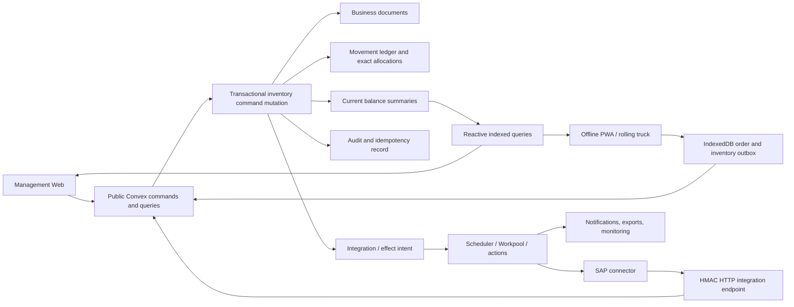

# Sunpride Turbo Inventory System Implementation Plan

**Status:** Proposed implementation specification; no inventory implementation is authorized by this document alone  
**Prepared:** 2026-09-02  
**Target repository:** `sunpride-turbo`  
**Reference implementation studied:** `itemcount-turbo`  
**Primary runtime:** Convex, with the Sunpride Web app, offline PWA, and outbound-only SAP connector

## 1. Purpose

This document defines the target inventory architecture for Sunpride Turbo. It transfers the business knowledge and operational lessons developed in Itemcount since 2023 without copying Itemcount's infrastructure literally.

Itemcount proves the required business behaviors: item and unit-of-measure control, multi-location stock, lot and expiry tracking, FEFO depletion, receiving, replenishment, reservations, transfers, POS depletion and cancellation, manufacturing/BOM consumption, work-order output, inventory adjustments, histories, reorder warnings, recovery, and external integrations. Sunpride must preserve those behaviors while using Convex transactions, reactive queries, scheduled functions, and components instead of rebuilding MongoDB, Redis, Kafka, BullMQ, and custom worker coordination.

This plan is intentionally broader than a stock-balance screen. The inventory system is the shared operational foundation for:

- raw materials, packaging materials, work in process, and finished goods;
- manufacturing and batch genealogy;
- warehouse and storage-bin operations;
- purchasing and goods receiving;
- internal warehouse, plant, and rolling-truck transfers;
- rolling-truck POS sales, returns, cancellations, and route closeout;
- lot, shelf-life, quarantine, damage, expiry, and recall controls;
- stock counts, discrepancies, adjustments, and approvals;
- SAP synchronization and reconciliation;
- availability, replenishment, costing, traceability, and audit reporting.

## 2. Executive recommendation

Build Sunpride inventory around an **immutable inventory movement ledger** in Convex. Every stock-changing command must atomically write:

1. the business document or document transition;
2. an inventory movement header and its lines;
3. the exact lot/location/status allocations;
4. immutable signed ledger entries;
5. current product-location and lot-location balance summaries;
6. the inventory command/idempotency result;
7. an audit event; and
8. any durable post-commit integration or notification intent.

If validation, allocation, or any balance write fails, the entire mutation fails. A sale, receipt, transfer, production completion, or cancellation must never be reported as inventory-complete while the corresponding stock posting is merely hoped to happen later.

The recommended authority boundary is:

- **Convex is authoritative for operational inventory**: quantities by product, lot, location, stock status, reservation, movement, and the exact allocations used by Web/PWA operations.
- **SAP remains authoritative for ERP master approval, finance/accounting outcomes, and the agreed financial inventory representation.**
- SAP inventory snapshots are imported as reconciliation observations. They must not blindly overwrite newer Convex operational balances.
- SAP-originated stock changes enter Convex as explicit, idempotent inventory commands such as opening balance, external receipt, external issue, or approved adjustment.

This changes the current repository statement that SAP is authoritative for all stock. An Architecture Decision Record must approve this boundary before inventory implementation begins. If SAP must remain the sole stock authority, then Sunpride cannot safely promise immediate offline POS, exact local lot allocation, or transactional manufacturing inventory; it can only capture pending intents and wait for SAP confirmation. That alternative is documented in Section 18.8 but is not recommended.

## 3. Current Sunpride state and gap analysis

### 3.1 Existing foundation

Sunpride Turbo already has useful foundations:

- a Bun/Turborepo monorepo;
- a Next.js management Web app;
- a Vite/React PWA with IndexedDB order and outbox support;
- a Convex backend with Better Auth, audit logs, workflows, and integration events;
- products, warehouses, `inventoryBalances`, orders, order lines, approvals, and SAP heartbeat/event ingestion;
- an outbound-only SAP connector with a local SQLite retry/dead-letter queue;
- HMAC-protected integration requests;
- client-generated order request IDs and a documented offline conflict policy.

### 3.2 Existing inventory behavior

The present inventory feature is a read-only availability snapshot:

- `products` contains a small product master projection;
- `warehouses` contains warehouse identity and location text;
- `inventoryBalances` stores `onHand`, `reserved`, `available`, and `asOf` by product code and warehouse code;
- `domains/inventory.ts` lists at most 100 rows;
- `integration/sap.ts` upserts those rows from `inventory.snapshot` events;
- the Web inventory page renders the snapshot as available-to-promise.

There are no operational inventory movements, exact allocations, lot balances, reservations, goods receipts, transfer lifecycles, stock counts, manufacturing postings, or exact reversals.

### 3.3 Gaps that must be closed

| Capability      | Current state            | Required target                                                                           |
| --------------- | ------------------------ | ----------------------------------------------------------------------------------------- |
| Source of truth | SAP snapshot overwrites  | Explicit operational authority and reconciliation boundary                                |
| Quantity model  | JavaScript numbers       | Scaled integer base quantities with governed conversions                                  |
| Products        | Minimal flat product row | Product master plus inventory, lot, shelf-life, costing, and replenishment policy         |
| Locations       | Warehouse only           | Site, warehouse, zone/bin, rolling truck, WIP, in-transit, and virtual boundary locations |
| Lots            | None                     | Batch/lot identity, dates, status, supplier/production origin, genealogy                  |
| Stock status    | None                     | Available, quarantine, quality hold, damaged, expired, rejected, WIP, in transit          |
| Movements       | None                     | Immutable headers, lines, allocations, ledger entries, and reversals                      |
| Balances        | SAP snapshot only        | Transactional product-location and lot-location operational summaries                     |
| Reservations    | One number in snapshot   | Traceable reservation documents and exact release/consume transitions                     |
| Receiving       | None                     | PO and non-PO receipts, partial receipt, inspection, discrepancy, costing                 |
| Transfers       | None                     | Request, approve, reserve, pick, ship, in transit, receive, discrepancy                   |
| POS             | Orders do not post stock | Truck-location depletion, offline idempotency, exact void/return                          |
| Manufacturing   | None                     | BOM versions, production orders, issues, outputs, yield/scrap, genealogy                  |
| Counts          | None                     | Blind counts, variance, approval, immutable adjustment posting                            |
| Recovery        | Integration retries only | Command idempotency, integrity checks, reconciliation, durable effects                    |
| Queries         | Unpaginated `take(100)`  | Indexed, scoped, paginated operational queries and exports                                |

## 4. What to transfer from Itemcount

The transfer target is business behavior and production knowledge, not a line-by-line port.

| Itemcount construct or lesson                      | Invariant to preserve                                                                 | Sunpride Convex design                                                                               | Do not copy                                                                    |
| -------------------------------------------------- | ------------------------------------------------------------------------------------- | ---------------------------------------------------------------------------------------------------- | ------------------------------------------------------------------------------ |
| Item, category, type, UOM, pricing, reorder fields | Every stock item has governed identity, precision, tracking, and replenishment policy | Normalize product core, UOM, inventory policy, costing policy, and replenishment policy              | One very large item document containing every concern                          |
| Lot and lot-location records                       | Tracked stock is known by lot and exact storage location                              | `inventoryLots` plus `inventoryLotBalances`                                                          | Scanning all lots to infer the current total on every request                  |
| FEFO depletion                                     | Automatic allocation is deterministic and expiry-aware                                | Indexed eligible lot-balance query ordered by expiry and receipt sequence                            | Depending on database insertion order or arbitrary first lot                   |
| Explicit lot depletion                             | User-selected lot/location must be honored or fail                                    | Store exact allocations on the source line and movement                                              | Falling back silently to another lot                                           |
| Depletion items                                    | Every stock issue has its business source                                             | Movement source type and source document/line IDs                                                    | Separate weakly linked records that can disagree with the sale                 |
| POS inventory saga v2                              | Desired stock outcome is durable; exact allocations can be restored                   | Atomic transaction for normal-size sale; durable operation intent only for bounded staged processing | Marking the sale depleted before stock side effects finish                     |
| `selectedLotDepletions`                            | Cancellation reverses the original physical allocation                                | Reversal entries reference original entries and allocations                                          | Replenishing an arbitrary current lot                                          |
| Transactional outbox                               | External side effects cannot be lost between business commit and publish              | Integration/outbox intent written in the same Convex mutation                                        | A network call inside a mutation or a best-effort event after commit           |
| Account-keyed Kafka ordering                       | Concurrent commands cannot create negative or double-applied stock                    | Convex serializable mutations, selective indexed reads, per-location balance documents, idempotency  | A global singleton lock/counter or parallel actions mutating the same stock    |
| Redis Pub/Sub                                      | Users see committed stock changes promptly                                            | Convex reactive queries                                                                              | Separate cache invalidation and subscription infrastructure                    |
| BullMQ workers                                     | Deferred work is durable, observable, and retryable                                   | Scheduler for simple work; Workpool/Workflow for bounded idempotent external work                    | Moving the core stock mutation into an asynchronous queue                      |
| PO receiving                                       | Receipt cannot exceed outstanding quantity without an explicit exception              | Receipt state machine, remaining-quantity check, lot creation, posting in one command                | Summing loosely linked lots to guess receipt state                             |
| External transfer through PO/SO                    | Sender issue and receiver receipt have a two-sided document lifecycle                 | Dedicated transfer, shipment, in-transit stock, receipt, and discrepancy documents                   | Hiding inventory-transfer semantics inside sales/purchase documents            |
| Work-order output and BOM depletion                | Output and component consumption must converge as one controlled manufacturing event  | Production posting mutation with issues, outputs, cost, and genealogy                                | Swallowing consumption errors after declaring output complete                  |
| Discrepancy approval                               | Variances need evidence and authorization                                             | Count/discrepancy/adjustment state machines with immutable postings                                  | Directly calling generic deplete/replenish helpers on approval                 |
| Item, lot, and location history                    | Investigators can reconstruct what changed and why                                    | Immutable movement/entry history plus audit metadata                                                 | An audit record that lacks before/after, source, actor, and allocation         |
| Reorder and expiry jobs                            | Operational risks must be surfaced                                                    | Indexed policy evaluations and deduplicated alert state                                              | Repeated alert spam or full-table scans                                        |
| Recovery incidents                                 | A queue completion flag is not proof that stock changed                               | Verify source, movement, allocation, ledger, balances, and audit as a chain                          | Treating `completed`, zero queue lag, or a notification as sufficient evidence |

## 5. Domain principles and non-negotiable invariants

### 5.1 Inventory is a ledger, not an editable number

Users and integrations never directly edit a balance. They submit a command that creates a movement. The movement produces ledger entries, and the same mutation updates balance summaries.

Corrections use a compensating movement. Posted ledger entries are never updated or deleted. Draft business documents may be edited before posting; posted stock effects are immutable.

### 5.2 One command, one atomic stock outcome

For every posted business command:

- the source document transition and stock posting commit together;
- every entry has a movement and line;
- every lot allocation has a source line and entry;
- every current balance reflects all committed entries through its version;
- every command key resolves to exactly one result;
- a retry returns that result without posting again.

### 5.3 Exact reversals

A reversal must reference the original movement and negate the original entries. It must restore or remove the same:

- product;
- base quantity;
- lot or serial identity;
- source and destination location;
- stock status;
- reservation allocation;
- cost layer or weighted-average effect, according to the approved costing rule.

If the original stock has since moved or been consumed, the command must not invent an impossible reversal. It enters a review-required state and offers an explicit compensating adjustment workflow.

### 5.4 No negative available stock by accident

The default invariant is:

```text
physicalBase >= 0
reservedBase >= 0
availableBase = usablePhysicalBase - reservedBase
availableBase >= 0
```

Negative stock, if the client truly requires it, must be an explicit policy scoped by organization, product, location type, and command type. Every negative posting must be flagged for reconciliation. The recommended launch policy is no negative stock.

### 5.5 Quantity and money are never binary floating point

Each product defines:

- `baseUomId`;
- `quantityScale` such as 1, 1,000, or 1,000,000;
- `quantityPrecision` for display and validation;
- allowed purchase, production, transfer, and sales UOMs;
- exact rational conversions to the base UOM.

Persist `quantityBase` values as Convex `v.int64()` values. At JSON boundaries such as the SAP connector and PWA outbox, transmit decimal strings with explicit scale or base-quantity strings. Persist money in minor units as `v.int64()`.

Conversions must fail closed when the unit type, factor, precision, or effective date is missing. Sunpride must not inherit Itemcount paths that catch conversion errors and continue with the unconverted quantity.

### 5.6 Lot and shelf-life rules are product policy

A product inventory policy defines whether:

- lot tracking is required on receipt, production, issue, sale, transfer, and return;
- manufacture date, expiry date, supplier batch, or internal batch is mandatory;
- FEFO, FIFO, or explicit-only allocation applies;
- minimum remaining shelf life applies per destination or customer;
- quality release is required before availability;
- split lots or mixed lots are allowed on a line;
- serial tracking is required later.

### 5.7 Every movement is organization- and location-scoped

All inventory tables include `organizationId`. Every public function derives the organization and permitted site/location scope from authenticated server-side membership. A client-provided organization or role is never trusted.

### 5.8 Posted inventory is auditable and attributable

Every posted movement records:

- actor and effective actor type: user, device, connector, system;
- business source type and source IDs;
- idempotency key and request payload hash;
- server posting time and business effective time;
- reason code and optional note;
- approval identity when required;
- original movement ID when reversing;
- integration source/event identifiers when external;
- before and after values on balance-affecting entries or a reproducible version chain.

## 6. Target architecture



### 6.1 Synchronous transactional core

The synchronous mutation owns all stock truth. Its internal algorithm is:

1. authenticate and derive organization/location scope;
2. validate command envelope, idempotency key, payload hash, and client timestamp policy;
3. return the prior result when the same key and hash already committed;
4. load the business document and its current state through selective indexes;
5. validate allowed state transition and approval requirements;
6. convert all quantities into base units, failing on any ambiguity;
7. select or validate exact lots using a deterministic indexed policy;
8. validate stock, shelf life, status, reservation, and downstream constraints;
9. create the movement header, lines, allocations, and signed entries;
10. update all affected product-location and lot-location balance summaries;
11. transition the source document and lines;
12. insert audit, command result, and integration/effect intents;
13. schedule post-commit internal work if needed; and
14. return a compact result containing IDs, states, allocations, and new balance versions.

All writes either commit or roll back together.

### 6.2 Reactive read model

Operational screens subscribe to indexed Convex queries over balance and document summaries. Redis Pub/Sub, custom WebSocket inventory channels, and manual cache invalidation are unnecessary.

Historical lists use cursor pagination. Queries never load all movements, lots, or balances with `.collect()` on unbounded data. Exports run as bounded jobs that page by indexed cursor and store generated files separately.

### 6.3 Asynchronous edge

Use asynchronous functions only for work that does not determine whether the stock posting happened:

- SAP submission and acknowledgement;
- email, push, or in-app notification fan-out;
- scheduled expiry and replenishment alert evaluation;
- large exports;
- long-running reconciliation scans;
- image/document processing;
- analytics rollups that can be rebuilt.

A movement must remain valid if those effects are delayed. Effects use stable `effectKey` values and idempotent destinations. Actions are retried only when their external effect is idempotent.

### 6.4 Suggested backend module layout

Do not place the inventory domain in one large `domains/inventory.ts` file. Use a bounded module tree:

```text
packages/backend/convex/
  inventory/
    public/
      balances.ts
      lots.ts
      movements.ts
      availability.ts
      receipts.ts
      transfers.ts
      reservations.ts
      counts.ts
      manufacturing.ts
      truckStock.ts
      reconciliation.ts
    commands/
      receive.ts
      reserve.ts
      issue.ts
      transfer.ts
      adjust.ts
      manufacture.ts
      reverse.ts
    internal/
      authz.ts
      quantities.ts
      allocation.ts
      posting.ts
      balances.ts
      costing.ts
      idempotency.ts
      stateMachines.ts
      integrity.ts
      effects.ts
    validators/
      shared.ts
      commands.ts
      responses.ts
    jobs/
      expiry.ts
      reorder.ts
      reconcileSap.ts
      export.ts
      effectDispatcher.ts
  integration/
    sapInventory.ts
```

Public functions perform authentication and input validation, then call plain TypeScript domain helpers. Internal functions are used for scheduled/connector work. All functions define argument and return validators.

## 7. Proposed Convex data model

The field lists below are implementation contracts, not illustrative suggestions. Names may change once for repository conventions, but the relationships and invariants must remain.

### 7.1 Shared conventions

Every business table uses the applicable subset of:

| Field                         | Purpose                                                                     |
| ----------------------------- | --------------------------------------------------------------------------- |
| `organizationId`              | Tenant boundary                                                             |
| `externalId` / `externalCode` | SAP or legacy identity without making it the Convex primary key             |
| `status`                      | Validated state-machine state                                               |
| `createdAt`, `updatedAt`      | Server timestamps in epoch milliseconds                                     |
| `createdBy`, `updatedBy`      | Authenticated actor IDs                                                     |
| `postedAt`, `postedBy`        | Immutable posting identity/time                                             |
| `effectiveAt`                 | Business-effective timestamp, controlled by backdate policy                 |
| `version`                     | Monotonic document or balance version where conflict diagnostics require it |
| `schemaVersion`               | Contract evolution for durable commands/events                              |

Avoid large nested arrays. Document lines, allocations, approvals, and histories live in separate indexed tables.

### 7.2 Master and policy tables

#### `unitsOfMeasure`

Fields:

- `organizationId` when client-specific, otherwise a governed global namespace;
- `code`, `name`, `dimension` (`COUNT`, `MASS`, `VOLUME`, `LENGTH`, `AREA`);
- `decimalPlaces`, `active`;
- optional SAP code and aliases.

Indexes:

- `by_org_code` on organization and code;
- `by_org_dimension` on organization, dimension, active.

#### `uomConversions`

Fields:

- `organizationId`, optional `productId` for product-specific conversions;
- `fromUomId`, `toUomId`;
- rational `numerator` and `denominator` as int64;
- `roundingMode`, `effectiveFrom`, optional `effectiveTo`, `active`;
- approval/audit fields.

Indexes:

- `by_org_product_from_to_effective`;
- `by_org_from_to_effective`.

Rules:

- Product-specific conversion wins over organization default.
- Reverse conversion is derived only when exact under configured precision.
- Changing a factor creates a new effective record; posted movements retain their normalized quantity and conversion snapshot.

#### `productInventoryPolicies`

One policy per product and organization.

Fields:

- `organizationId`, `productId`, `baseUomId`, `quantityScale`, `quantityPrecision`;
- `trackingMode`: `NONE`, `LOT`, or future `SERIAL`;
- `allocationPolicy`: `FEFO`, `FIFO`, `EXPLICIT_ONLY`;
- `allowMixedLotsPerLine`, `allowNegativeStock`, `qualityReleaseRequired`;
- `shelfLifeDays`, `expiryDateRequired`, `manufactureDateRequired`;
- `minimumRemainingShelfLifeDays` default;
- `costingMethod`: initial target `WEIGHTED_AVERAGE`, optional future `FIFO_LAYER`;
- `reservationPolicy`, `returnPolicy`, `active`.

Indexes:

- `by_org_product` unique-by-command invariant;
- `by_org_tracking_active`.

#### `replenishmentPolicies`

Fields:

- `organizationId`, `productId`, optional `locationId`;
- `enabled`, `reorderPointBase`, `targetLevelBase`, `safetyStockBase`;
- optional lead-time days, review period, minimum/maximum order quantity;
- preferred supplier/site, alert recipients, and alert cooldown;
- `lastAlertState`, `lastAlertedAt`.

Indexes:

- `by_org_product_location`;
- `by_org_enabled`.

### 7.3 Location model

#### `inventoryLocations`

Unify stock-bearing places under one model rather than switching between branch and inventory-location entity types.

Fields:

- `organizationId`, `siteId`, optional `warehouseId`, optional `parentLocationId`;
- `code`, `name`;
- `type`: `WAREHOUSE`, `ZONE`, `BIN`, `PRODUCTION`, `WIP`, `TRUCK`, `IN_TRANSIT`, `RETURNS`, `VIRTUAL_BOUNDARY`;
- `operationalStatus`, `active`;
- `allowsPicking`, `allowsReceiving`, `allowsSale`, `allowsProduction`;
- optional assigned truck, device, route, temperature class, or capacity;
- SAP code/external ID.

Indexes:

- `by_org_code`;
- `by_org_site_type_active`;
- `by_org_warehouse_parent`;
- `by_org_truck`.

Use virtual boundary locations for `SUPPLIER`, `CUSTOMER`, `ADJUSTMENT_GAIN`, `ADJUSTMENT_LOSS`, `PRODUCTION_CONSUMPTION`, and `PRODUCTION_OUTPUT` when useful for balanced movement semantics. They are not selectable as physical storage.

#### `locationProductSettings`

Fields:

- `organizationId`, `locationId`, `productId`;
- enabled/blocked, minimum shelf life, default pick policy override;
- capacity or par level;
- preferred replenishment source.

Index: `by_org_location_product`.

### 7.4 Lot and quality tables

#### `inventoryLots`

Fields:

- `organizationId`, `productId`;
- `lotNumber`, normalized searchable lot number, optional supplier lot number;
- `sourceType`: receipt, production, opening balance, return, external;
- `sourceDocumentId`, `sourceLineId`;
- optional supplier, production order, BOM version, and parent-lot references;
- `manufacturedAt`, `receivedAt`, `expiresAt`;
- `qualityStatus`: `PENDING`, `RELEASED`, `QUARANTINED`, `REJECTED`, `EXPIRED`;
- unit cost snapshot and currency;
- `closedAt`, recall/hold fields, notes.

Indexes:

- `by_org_product_lot_number`;
- `by_org_product_expiry`;
- `by_org_quality_expiry`;
- `by_org_source`;
- `by_org_supplier_lot`.

Lot number uniqueness is governed per organization/product unless the client approves a stricter organization-wide rule.

#### `lotGenealogyLinks`

Fields:

- `organizationId`;
- `productionOrderId`, `outputLotId`, `componentLotId`;
- `componentProductId`, `quantityBase` consumed;
- `movementId`, `movementLineId`.

Indexes:

- `by_org_output_lot` for backward trace;
- `by_org_component_lot` for forward recall trace;
- `by_org_production_order`.

#### `qualityHolds`

Fields:

- organization, lot/product/location scope;
- reason code, status, created/approved/released identities;
- evidence file IDs and notes;
- movement IDs that placed and released the hold.

Holding stock moves it from an eligible status to `QUALITY_HOLD` or `QUARANTINE`; it does not merely set a display flag.

### 7.5 Operational balance tables

#### `inventoryBalances`

This replaces the current snapshot semantics and becomes the operational product-location summary.

Fields:

- `organizationId`, `productId`, `locationId`;
- `physicalBase`, `reservedBase`, `availableBase`;
- `qualityHoldBase`, `quarantineBase`, `damagedBase`, `expiredBase`;
- optional `inTransitOutboundBase` and `inTransitInboundBase` summary values;
- `weightedAverageCostMinorPerBase`, `inventoryValueMinor` when enabled;
- `version`, `lastMovementId`, `updatedAt`.

Indexes:

- `by_org_product_location`;
- `by_org_location_product`;
- `by_org_location_available` where query shape requires it;
- `by_org_product_updated` for sync and reconciliation.

Invariants:

- only one row per organization/product/location;
- `availableBase = physicalBase - reservedBase - nonUsablePhysicalBase`, using one documented equation;
- all values and cost summaries update in the posting transaction;
- no user or connector directly patches this table.

#### `inventoryLotBalances`

Fields:

- `organizationId`, `productId`, `lotId`, `locationId`, `stockStatus`;
- `physicalBase`, `reservedBase`, `availableBase`;
- `expirySortKey`, `receiptSequence`, `version`, `lastMovementId`.

Indexes:

- `by_org_product_location_status_expiry` for FEFO;
- `by_org_lot_location_status`;
- `by_org_location_product_status`;
- `by_org_lot`;
- `by_org_expiry_status` for expiry jobs.

The product-location balance equals the sum of its lot balances for lot-tracked products. Integrity jobs continuously sample and compare this invariant, but the posting mutation preserves it synchronously.

#### `sapInventorySnapshots`

Preserve imported ERP observations separately.

Fields:

- `organizationId`, product/warehouse codes and resolved IDs;
- on-hand/reserved/available quantities normalized to base units;
- `asOf`, source event ID/sequence, received time, payload hash;
- resolution status and optional reconciliation run ID.

Indexes:

- `by_org_product_location_as_of`;
- `by_org_event_id`;
- `by_org_resolution_as_of`.

### 7.6 Immutable movement and command tables

#### `inventoryCommands`

Fields:

- `organizationId`, `idempotencyKey`, `commandType`, `schemaVersion`;
- `payloadHash`, actor/device/source metadata;
- `status`: `POSTED`, `REJECTED`, or `REVIEW_REQUIRED`;
- optional source document and movement IDs;
- compact result/error code, created/committed times.

Index: `by_org_idempotency_key`.

Rules:

- same key and same hash returns the stored result;
- same key and different hash rejects as an idempotency collision;
- the indexed uniqueness check and insert happen in the command mutation;
- rejected user-correctable validation may be returned without permanently consuming the key; committed review-required outcomes do consume it.

#### `inventoryMovements`

Fields:

- `organizationId`, `movementNumber`, `movementType`;
- `sourceType`, `sourceDocumentId`, optional source line/route/shift IDs;
- `status`: `POSTED` or `REVERSED` summary only;
- `effectiveAt`, `postedAt`, `postedBy`, actor/device data;
- `idempotencyKey`, `reasonCode`, note;
- optional `reversesMovementId`, `reversedByMovementId`;
- optional SAP submission and acknowledgement summary;
- `schemaVersion`.

Indexes:

- `by_org_number`;
- `by_org_source`;
- `by_org_type_effective`;
- `by_org_product` is not needed on the header; use lines;
- `by_org_reverses`;
- `by_org_posted_at`.

#### `inventoryMovementLines`

Fields:

- `organizationId`, `movementId`, `lineNumber`;
- `productId`, `baseUomId`, `quantityBase` absolute value;
- entered quantity/UOM and conversion snapshot;
- `fromLocationId`, `toLocationId`, `fromStockStatus`, `toStockStatus` as applicable;
- source document line ID;
- unit cost and total cost snapshots;
- allocation mode and reason.

Indexes:

- `by_org_movement_line`;
- `by_org_product_effective`;
- `by_org_source_line`;
- `by_org_from_location_effective`;
- `by_org_to_location_effective`.

#### `inventoryAllocations`

One row per exact lot/serial allocation on a movement line.

Fields:

- `organizationId`, `movementId`, `movementLineId`;
- `productId`, `lotId`, `quantityBase`;
- `fromLocationId`, `toLocationId`, from/to stock status;
- `allocationSequence`, policy used, user-selected flag;
- `reversesAllocationId` when compensating.

Indexes:

- `by_org_movement_line`;
- `by_org_lot_effective`;
- `by_org_source_location`;
- `by_org_reverses_allocation`.

#### `inventoryLedgerEntries`

Each affected balance bucket receives a signed entry.

Fields:

- `organizationId`, `movementId`, `movementLineId`, optional `allocationId`;
- `productId`, optional `lotId`, `locationId`, `stockStatus`;
- `quantityDeltaBase`, `reservedDeltaBase`, optional cost/value deltas;
- balance version and before/after snapshots;
- `effectiveAt`, `postedAt`;
- optional `reversesEntryId`.

Indexes:

- `by_org_movement`;
- `by_org_product_location_effective`;
- `by_org_lot_location_effective`;
- `by_org_effective`;
- `by_org_reverses_entry`.

Ledger entries are immutable and retained for the full legal/audit retention period. Archive strategy may move old query projections, but never discard the authoritative trace without approved retention policy.

### 7.7 Reservation tables

#### `inventoryReservations`

Fields:

- organization, reservation number/type;
- source order, transfer, production order, route load, or manual hold;
- status: `ACTIVE`, `PARTIALLY_CONSUMED`, `CONSUMED`, `RELEASED`, `EXPIRED`, `CANCELLED`;
- priority, expiry, actor, customer/route context.

#### `inventoryReservationLines`

Fields:

- reservation and source line IDs;
- product, location, requested/reserved/consumed/released base quantities;
- optional lot ID for hard lot reservations;
- policy and timestamps.

Indexes:

- by reservation;
- by organization/source;
- by organization/product/location/status;
- by organization/status/expiry.

Hard reservations reduce `availableBase` in the same mutation. Soft planning demand does not change physical availability and belongs in a separate planning projection.

### 7.8 Receiving tables

#### `goodsReceipts`

Fields:

- organization, receipt number, type (`PURCHASE_ORDER`, `TRANSFER`, `RETURN`, `PRODUCTION`, `UNPLANNED`);
- source document, supplier/sender, receiving location;
- status: `DRAFT`, `IN_INSPECTION`, `PARTIALLY_POSTED`, `POSTED`, `CANCELLED`, `REVIEW_REQUIRED`;
- delivery reference, receiver, dates, evidence, notes;
- movement IDs and SAP state.

#### `goodsReceiptLines`

Fields:

- receipt and source line IDs;
- product, entered/base quantities, accepted/rejected quantities;
- lot, manufacture/expiry/supplier batch information;
- destination location/status;
- price, landed cost, tax/currency snapshots as inventory valuation requires;
- discrepancy reason and posting state.

Indexes cover receipt, source line, product, lot, and status/date.

The existing order domain may later represent purchase orders, or dedicated `purchaseOrders` and `purchaseOrderLines` may be added. Whichever owns procurement, inventory must receive through the receipt tables rather than create lots directly from a PO mutation.

### 7.9 Transfer tables

#### `stockTransfers`

Fields:

- organization, transfer number, transfer type;
- source and destination locations/sites;
- status: `DRAFT`, `REQUESTED`, `APPROVED`, `RESERVED`, `PICKING`, `SHIPPED`, `PARTIALLY_RECEIVED`, `RECEIVED`, `CANCELLED`, `REVIEW_REQUIRED`;
- requested/approved/picked/shipped/received actors and times;
- route/truck context, expected arrival, notes;
- outbound, in-transit, receipt, discrepancy, and reversal movement IDs.

#### `stockTransferLines`

Fields:

- transfer and product IDs;
- requested, approved, reserved, picked, shipped, received, rejected, and short base quantities;
- UOM snapshot, explicit lots when required;
- source/destination line state.

#### `stockTransferAllocations`

Exact source lot/location picks and corresponding destination receipt identity. This remains stable through shipment and receipt.

Indexes cover organization/status/date, source/destination, route/truck, transfer lines, and allocation lot.

### 7.10 Count, discrepancy, and adjustment tables

#### `stockCountSessions`

Fields:

- organization, count number/type (`CYCLE`, `FULL`, `SPOT`, `ROUTE_CLOSE`);
- site/location and optional product/category scope;
- status: `DRAFT`, `FROZEN`, `COUNTING`, `SUBMITTED`, `REVIEWED`, `APPROVED`, `POSTED`, `CANCELLED`;
- blind-count setting, snapshot cutoff/version, counters, approver, timestamps.

#### `stockCountLines`

Fields:

- session, product, optional lot, location/status;
- system quantity at cutoff, first/second/final counted quantity;
- variance, finding (`OVER`, `MISSING`, `DAMAGED`, `EXPIRED`, `WRONG_LOT`, `WRONG_LOCATION`);
- notes, evidence, counter identities;
- adjustment line/movement reference after posting.

#### `inventoryAdjustments`

Fields:

- organization, adjustment number/type/reason;
- source count/discrepancy or manual request;
- state: `DRAFT`, `SUBMITTED`, `APPROVED`, `POSTED`, `REJECTED`, `REVERSED`;
- requester/approver/poster and separation-of-duty evidence;
- movement IDs.

#### `inventoryAdjustmentLines`

Fields include product, lot, location/status, signed base variance, unit cost rule, evidence, and reason.

Approving an adjustment does not edit stock. Posting the approved adjustment creates the immutable movement and transitions the adjustment atomically.

### 7.11 Manufacturing tables

#### `billOfMaterials`

The BOM identity for a finished or intermediate product.

Fields:

- organization, product, code/name, active, revision policy.

#### `billOfMaterialVersions`

Fields:

- BOM, version/revision, output quantity/UOM;
- status: `DRAFT`, `APPROVED`, `ACTIVE`, `OBSOLETE`;
- effective dates, yield target, default production site/location;
- approval and change reason.

Posted production orders pin a version and conversion snapshot. Editing an active version creates a new version.

#### `billOfMaterialComponents`

Fields:

- BOM version, component product, quantity/UOM/base quantity per output basis;
- issue policy (`BACKFLUSH`, `MANUAL_ISSUE`, `STAGED`);
- scrap allowance, substitute group, optional/required flag;
- preferred source location and allocation policy override.

#### `productionOrders`

Fields:

- organization, production order number, product, BOM version;
- planned/started/completed/scrapped base quantities;
- site, staging/WIP/output locations;
- status: `DRAFT`, `RELEASED`, `MATERIAL_STAGED`, `IN_PROGRESS`, `PARTIALLY_COMPLETED`, `COMPLETED`, `CANCELLED`, `CLOSED`, `REVIEW_REQUIRED`;
- dates, batch plan, responsible users, SAP state.

#### `productionMaterialRequirements`

Frozen expected component quantities by production order and component. Track required, reserved, staged, issued, returned, and variance quantities.

#### `productionMaterialIssues`

Headers/lines for actual component issue or return, with exact component lot allocations and movement IDs.

#### `productionOutputReceipts`

Headers/lines for actual output, output lot, quantity, quality status, manufacture/expiry dates, yield, movement, and cost rollup.

#### `productionScrapRecords`

Product/component, lot, quantity, stage, reason, approver, cost treatment, and movement.

This model supports partial completion, multiple outputs, by-products in a later extension, actual-versus-standard consumption, and full lot genealogy.

### 7.12 Rolling-truck and offline custody tables

#### `truckRouteSessions`

Fields:

- organization, truck/location, route, salesperson/cashier, assigned device;
- opening and closing times/states;
- opening balance checkpoint, load/unload transfer IDs;
- sync lease and last acknowledged sequence;
- status: `PLANNED`, `LOADING`, `OPEN`, `CLOSING`, `RECONCILING`, `CLOSED`, `REVIEW_REQUIRED`.

#### `truckInventoryCheckpoints`

Compact signed server snapshot metadata per route session, not an unbounded embedded item list. Lines belong in `truckInventoryCheckpointLines` and contain product/lot quantities and balance versions.

#### `deviceCommandSequences`

Fields:

- organization, device, route session;
- last accepted client sequence, last request ID, lease status, updated time.

This catches missing or reordered offline commands in addition to normal idempotency.

### 7.13 Integration, reconciliation, and effects

#### `inventoryIntegrationEvents`

The current generic `integrationEvents` may be extended or a typed inventory table added. Required fields:

- organization, direction, system, event type/schema version;
- stable external event/effect key, payload hash;
- source document/movement IDs;
- status, attempts, next attempt, last error, acknowledgement data;
- created, sent, acknowledged, dead-letter times.

#### `inventoryReconciliationRuns`

Fields:

- organization, scope, Convex cutoff, SAP snapshot cutoff;
- status, counts and value totals;
- cursor/progress, started/completed identities/times.

#### `inventoryReconciliationDifferences`

Fields:

- run, product, location, optional lot;
- Convex quantity, SAP quantity, difference;
- classification: mapping, timing, missing inbound, missing outbound, duplicate, unauthorized adjustment, unresolved;
- linked events/movements and resolution state.

Reconciliation never repairs automatically unless a separately approved, idempotent adjustment command is generated and posted.

## 8. State machines and stock-effect moments

### 8.1 Goods receipt

```text
DRAFT -> IN_INSPECTION -> POSTED
                    \-> PARTIALLY_POSTED -> POSTED
DRAFT/IN_INSPECTION -> CANCELLED
POSTED -> reversal receipt movement, never CANCELLED in place
```

Stock effect occurs only on line posting. Accepted quantity enters `AVAILABLE` or `QUALITY_HOLD` per product policy. Rejected quantity enters an explicit rejected/quarantine status only if physically retained; otherwise it does not enter Sunpride stock.

### 8.2 Transfer

```text
DRAFT -> REQUESTED -> APPROVED -> RESERVED -> PICKING -> SHIPPED
SHIPPED -> PARTIALLY_RECEIVED -> RECEIVED
eligible pre-ship states -> CANCELLED
any inconsistent posted state -> REVIEW_REQUIRED
```

Stock effects:

- reserve: increases source reserved quantity;
- ship: releases reservation, decreases source physical, increases in-transit custody;
- receive: decreases in-transit, increases destination physical/status;
- discrepancy: posts explicit shortage, damage, or overage resolution after approval.

### 8.3 Reservation

```text
ACTIVE -> PARTIALLY_CONSUMED -> CONSUMED
ACTIVE/PARTIALLY_CONSUMED -> RELEASED | EXPIRED | CANCELLED
```

Every transition updates reserved and available balances atomically. Consumption links the reservation line to the issue movement allocation.

### 8.4 POS sale and cancellation

```text
LOCAL_DRAFT -> QUEUED -> SERVER_POSTED
SERVER_POSTED -> PARTIALLY_VOIDED | VOIDED | RETURNED
QUEUED conflict -> REVIEW_REQUIRED or REJECTED, never silently posted differently
```

The server-post mutation creates the sale/order final state and inventory issue together. A partial void changes the desired sold quantity by creating an exact reversal for the removed portion. A full void reverses all original allocations. Returns use a return receipt and disposition rule; they are not assumed resellable.

### 8.5 Stock count and adjustment

```text
Count: DRAFT -> FROZEN -> COUNTING -> SUBMITTED -> REVIEWED -> APPROVED -> POSTED
Adjustment: DRAFT -> SUBMITTED -> APPROVED -> POSTED
```

The count snapshot captures system quantity/version at the approved cutoff. Movement after the cutoff is accounted for explicitly during variance calculation. Posting the adjustment is the only stock effect.

### 8.6 Production order

```text
DRAFT -> RELEASED -> MATERIAL_STAGED -> IN_PROGRESS
IN_PROGRESS -> PARTIALLY_COMPLETED -> COMPLETED -> CLOSED
eligible states -> CANCELLED
posting conflict -> REVIEW_REQUIRED
```

Stock effects occur through separate but linked postings:

- reserve/stage components;
- issue components to WIP or consumption;
- receive finished/intermediate output by lot and quality status;
- record scrap/by-product;
- return unused staged material;
- close only when requirements and variances are resolved.

Output must never be declared completed while component depletion fails invisibly.

### 8.7 Quality status

```text
PENDING/QUALITY_HOLD -> RELEASED
PENDING/RELEASED -> QUARANTINED
QUARANTINED -> RELEASED | REJECTED
RELEASED -> EXPIRED when shelf life passes and usable stock remains
```

Each transition posts a status-to-status movement. Expiry must not be a display-only date check because expired stock must leave available-to-promise.

## 9. Detailed command algorithms

### 9.1 Receive purchase order or unplanned stock

Inputs include command key, source line, receiving location, entered quantity/UOM, lot dates, accepted/rejected quantities, price/cost, evidence, and actor.

Algorithm:

1. authenticate receiver and location scope;
2. idempotency check;
3. load source PO/line when present;
4. calculate previously posted receipt quantity from indexed receipt lines, not by scanning lots;
5. reject quantity above remaining unless an approved over-receipt tolerance applies;
6. convert all quantities to base units;
7. validate lot/shelf-life/quality requirements;
8. create or resolve the lot identity;
9. create receipt line, movement line, allocation, and inbound ledger entries;
10. update lot and product-location balances and weighted-average cost;
11. transition PO/receipt lines to partial or complete;
12. create audit, command result, and SAP effect intent;
13. return receipt, lot, movement, and balance versions.

Acceptance cases include partial receipt, receive-all in bounded line batches, over-receipt tolerance, wrong/expired batch, rejected quantity, duplicate command, and same lot received in multiple deliveries.

### 9.2 Allocate and issue stock

Allocation modes:

- explicit lot/location supplied by authorized user;
- deterministic FEFO;
- deterministic FIFO;
- consume an existing hard reservation.

FEFO candidate query:

1. select `inventoryLotBalances` by organization, product, location, eligible stock status, and expiry sort key;
2. exclude expired, held, quarantined, damaged, closed, insufficient-shelf-life, or zero-available rows;
3. order by expiry, then receipt sequence, then stable document ID;
4. take a bounded page sufficient for the requested quantity;
5. split requested base quantity over candidates;
6. fail if insufficient total; never partially post unless the source workflow explicitly supports partial fulfillment;
7. store every chosen allocation.

The posting mutation then decrements the exact rows and summary balance. Automatic allocation must produce the same plan for the same committed snapshot.

### 9.3 Reserve, release, and consume

Reserve:

- validate demand/source state;
- allocate by product-location, optionally by lot;
- increment reservation line and balance `reservedBase`;
- decrement `availableBase` without changing physical stock.

Release:

- release only outstanding reservation quantity;
- reverse the reserved delta and update reservation state.

Consume:

- validate issue quantity does not exceed outstanding reserved quantity;
- turn the reservation allocation into exact issue allocations;
- decrement physical and reserved quantities in the same posting;
- preserve the source reservation link for audit.

### 9.4 Post a rolling-truck POS sale

Inputs must include route session, device, monotonically increasing device sequence, `clientRequestId`, order payload hash, sale lines, selected/locally allocated lots, and client creation time.

Algorithm:

1. authenticate user/device and confirm active route-session lease;
2. check request ID and payload hash;
3. enforce expected device sequence or explicitly classify a gap;
4. validate order totals and sale state in the order domain;
5. validate each product against truck-location balances;
6. compare local lot allocations with current server eligibility;
7. use the exact local allocations if still valid; otherwise reject for conflict rather than silently choose different lots;
8. atomically post order, order lines, inventory issue movement, allocations, balances, command result, audit, and SAP effect;
9. return server order/movement IDs, exact accepted allocations, new balance versions, and next sequence.

This single mutation is preferred for ordinary POS basket sizes. Set an explicit maximum line and allocation count from measured Convex transaction headroom. Larger wholesale documents use a controlled staged workflow and cannot show `POSTED` until all inventory postings complete.

### 9.5 Void or partially void a POS sale

1. load the posted sale and movement by indexed source link;
2. authorize void/approval and determine desired retained quantities per line;
3. compute the exact allocation portions to reverse from the original allocations;
4. verify no incompatible downstream movement makes physical reversal impossible;
5. create a reversal movement whose entries negate the selected originals;
6. update balances and sale state atomically;
7. create refund/accounting effect intents separately;
8. if exact reversal is physically impossible, create `REVIEW_REQUIRED` without falsifying stock.

Cancellation success is proven only by the linked reversal movement, negated allocations, final balances, and audit record.

### 9.6 Transfer stock

Request/approve:

- validate source/destination, product eligibility, and separation of duties;
- optionally create a hard reservation.

Pick/ship:

- capture exact lots and quantities;
- consume source reservation;
- move physical quantity from source to the transfer's in-transit custody location/status;
- preserve each allocation and seal shipment quantities.

Receive:

- receive against shipped allocation, never just requested quantity;
- move accepted quantity from in-transit to destination;
- move damaged/rejected quantity to an explicit status/location;
- keep shortages unresolved until approved disposition;
- transition partial/complete state from totals.

Cancel:

- pre-ship: release reservation;
- post-ship: perform a return-to-source or approved diversion transfer, never erase shipment history.

### 9.7 Post manufacturing consumption and output

For a normal-size completion event, use one mutation so component issue and output receipt cannot diverge.

1. load production order and pinned BOM version;
2. validate remaining producible quantity and authorization;
3. calculate standard component requirement for actual output;
4. apply approved substitutions, scrap allowance, and entered actual quantities;
5. convert to base quantities, fail closed on any conversion;
6. allocate exact component lots from staged/WIP or source locations;
7. validate component stock and expiry/quality policy;
8. create component issue movements and allocations;
9. create output lot(s), output receipt movement, and quality status;
10. compute actual material cost and update output lot/cost summaries;
11. create genealogy links from every component lot to every output lot;
12. update production quantities, variances, state, balances, command, audit, and SAP effects atomically.

When a production event exceeds transaction limits, use a durable operation with reserved/staged inputs, bounded posting chunks, an explicit `POSTING` state, and an all-or-compensate protocol. The UI must not claim `COMPLETED` before convergence. This path is a measured exception, not the default.

### 9.8 Reverse manufacturing

Reversal is allowed only when output lots and component allocations can be traced and the output has not been consumed, transferred, sold, transformed, or quality-disposed beyond the reversible quantity.

If reversible:

- negate output receipt entries;
- restore exact component lots/statuses/locations;
- reverse cost and genealogy effects;
- update production order through a dedicated correction state.

If not reversible, require explicit product disposal/adjustment and component correction documents. Never recreate arbitrary component lots.

### 9.9 Stock count and adjustment

1. define count scope and freeze a logical cutoff/version;
2. optionally restrict moves or record all concurrent moves after the cutoff;
3. capture blind first and optional second counts by product/lot/location/status;
4. calculate expected-at-count-time and variance;
5. classify findings and collect evidence;
6. enforce approval threshold and separation of duties;
7. create an approved adjustment document;
8. post signed entries to the exact product/lot/location/status;
9. transition count and adjustment atomically;
10. emit reconciliation and SAP effects.

### 9.10 Put lot on hold, release, reject, or expire

The command validates current quantity and status, creates a status-transfer movement, updates both balance levels, records hold/release evidence, and triggers downstream availability changes. A daily expiry job identifies eligible remaining lots and posts bounded idempotent expiry-status commands. The alert job and stock-status posting are distinct: alert failure must not keep expired stock available.

## 10. Rolling-truck offline design

### 10.1 Custody model

Treat each rolling truck as a stock-bearing `TRUCK` inventory location. Loading a truck is an approved warehouse-to-truck transfer. The salesperson sells only from the assigned truck location during an open route session. Route close compares:

```text
opening truck stock
+ route loads
+ accepted customer returns
- posted sales
- approved damage/expiry
- unloads back to warehouse
= expected closing stock
```

Physical close counts create route-close variances and an approval workflow.

### 10.2 Single-writer recommendation

For safe offline operation, one active device/route-session lease should own a truck's sellable inventory. This dramatically reduces concurrency conflicts: different trucks modify different balance documents, while one truck has one ordered local command stream.

If multiple devices must sell from the same truck while offline, exact no-oversell guarantees are impossible without pre-partitioning stock by device or requiring connectivity. The plan recommends device-specific sublocations or reservations rather than accepting last-write-wins conflicts.

### 10.3 PWA local data

IndexedDB stores:

- active route and signed/checksummed opening checkpoint metadata;
- product, UOM, price, tax, and customer projections needed for the route;
- truck product/lot balances and their server versions;
- local sale documents;
- immutable local inventory command outbox;
- per-command state, attempts, and last server result;
- device sequence and last acknowledged server sequence.

Local optimistic stock is derived by replaying unsynced commands over the last server checkpoint. Do not directly mutate a lone local balance number without retaining its originating command.

### 10.4 Sync protocol

1. enqueue sale and inventory command in one IndexedDB transaction;
2. apply optimistic local allocation and update the UI;
3. send commands FIFO with one in flight per route session;
4. server checks request ID, hash, route lease, and sequence;
5. server returns accepted exact allocations and balance versions;
6. mark command acknowledged and advance checkpoint;
7. rebuild local projection from server state plus remaining commands;
8. on conflict, stop the dependent queue and show a resolvable exception.

Convex React's in-memory retry is useful for transient connected sessions, but it is not a substitute for the durable IndexedDB outbox because browsers and devices can close while offline.

### 10.5 Conflict classes

| Conflict                           | Required behavior                                                       |
| ---------------------------------- | ----------------------------------------------------------------------- |
| Duplicate request, same hash       | Return original success                                                 |
| Duplicate request, different hash  | Reject idempotency collision                                            |
| Missing device sequence            | Pause queue and retrieve authoritative status                           |
| Lot no longer eligible             | Reject line/order for supervised resolution; do not silently reallocate |
| Insufficient truck stock           | Reject or explicitly split fulfillment according to approved POS policy |
| Route already closed               | Reject and require supervisor reopen/correction workflow                |
| Product/UOM policy changed offline | Reject with policy-version mismatch and refresh master data             |
| Clock drift/backdate               | Use server posted time; apply bounded effective-time policy             |

## 11. Costing and valuation

### 11.1 Initial method

Use perpetual weighted-average cost by organization/product/location scope approved by finance. If SAP financial inventory requires organization-wide or plant-wide valuation, maintain that scope explicitly rather than averaging arbitrary warehouses.

Receipt posting calculates:

```text
new value = prior eligible inventory value + received value + allocated landed cost
new quantity = prior eligible inventory quantity + received quantity
new weighted average = new value / new quantity
```

Issues carry the weighted-average unit cost at posting time. Reversals negate the original issue value where accounting policy allows. Adjustments require a documented valuation rule.

### 11.2 Cost snapshots

Persist cost method, unit cost, total value delta, currency, and relevant rate on movement lines/entries. Never recompute historical COGS from today's product cost.

### 11.3 Manufacturing cost

Finished output cost can initially include:

- actual component issue value;
- approved direct landed or conversion cost inputs;
- later labor and overhead allocation when requirements are confirmed.

Cost variance between standard BOM and actual issue is reported by production order. SAP remains the final financial authority until finance signs off on local valuation parity.

### 11.4 Precision

Use int64 minor units and a documented division/rounding rule. Store rounding residue explicitly at document completion rather than allowing hidden drift across lines.

## 12. Availability and replenishment

### 12.1 Availability definitions

Expose distinct measures; do not label all of them `available`:

- **Physical on hand:** all physically present stock, including non-usable statuses if requested.
- **Usable on hand:** released, unexpired, undamaged stock.
- **Hard reserved:** committed to approved demand.
- **Available to promise (ATP):** usable on hand minus hard reservations, optionally plus confirmed inbound within a requested horizon.
- **In transit:** shipped but not received.
- **Projected available:** ATP plus planned supply minus soft demand.

The initial operational command guard uses current usable available stock, not a future projection.

### 12.2 Reorder evaluation

After a posting changes a product-location balance, schedule a deduplicated policy evaluation with a stable key. It compares availability to reorder/safety thresholds and changes an alert state. Alert only on state transition or cooldown expiration. Clearing the low-stock condition closes the alert state.

Do not recalculate all products after every movement.

### 12.3 Expiry and shelf-life

Provide indexed queries and alerts for configurable horizons such as 90/60/30/15/7 days. Destination/customer minimum remaining shelf life is checked at allocation and transfer receipt. FEFO does not override a blocked or quality-held lot.

## 13. Queries and user-facing modules

All list queries are organization- and permission-scoped, index-backed, cursor-paginated, and bounded by bytes/rows.

### 13.1 Core queries

- inventory overview by site, warehouse, truck, category, and stock status;
- product availability across locations;
- product stock card/movement history;
- lot balances and expiry timeline;
- lot backward/forward genealogy and recall exposure;
- location contents;
- reservation availability and demand source;
- goods receipt/transfer/count/adjustment/production work queues;
- truck route stock and sync exceptions;
- negative/integrity/reconciliation exception dashboards;
- SAP event and acknowledgement status.

### 13.2 Management Web modules

1. Inventory dashboard and availability.
2. Products and inventory policies.
3. Warehouses, bins, trucks, and location settings.
4. Lots, expiry, quality hold, and recall.
5. Goods receiving and inspection.
6. Reservations, picking, and fulfillment.
7. Stock transfers and in-transit monitoring.
8. Stock count and approved adjustments.
9. BOM and production inventory.
10. Replenishment and alerts.
11. Stock card, movement audit, and exports.
12. SAP reconciliation and integration exceptions.

### 13.3 PWA modules

1. Route/session open and sync readiness.
2. Truck load receipt/confirmation.
3. Offline product and lot availability.
4. POS stock posting and exact void/return.
5. Damage/expiry capture with evidence.
6. Route close count and unload.
7. Sync queue, conflicts, and supervised recovery.

### 13.4 Query response rules

- Return IDs and compact projections, not entire joined documents.
- Resolve relations in bounded pages.
- Use dedicated search indexes only where product/lot text search requires them.
- Avoid client-side filtering of tenant-wide result sets.
- Export by asynchronous paginated job when the result can be large.

## 14. Authorization and approvals

### 14.1 Suggested capabilities

- `inventory.view`;
- `inventory.receive`;
- `inventory.inspect`;
- `inventory.reserve`;
- `inventory.pick`;
- `inventory.transfer.request`;
- `inventory.transfer.approve`;
- `inventory.transfer.ship`;
- `inventory.transfer.receive`;
- `inventory.count`;
- `inventory.adjust.request`;
- `inventory.adjust.approve`;
- `inventory.adjust.post`;
- `inventory.quality.hold` and `inventory.quality.release`;
- `manufacturing.bom.manage` and `manufacturing.bom.approve`;
- `manufacturing.issue`, `manufacturing.complete`, `manufacturing.close`;
- `pos.sell`, `pos.void`, `pos.void.approve`;
- `inventory.reconcile`;
- `inventory.admin`.

### 14.2 Location scope

Membership can restrict users to sites, warehouses, or trucks. Both read queries and mutations enforce scope server-side. A transfer requires authority over the applicable action and location side.

### 14.3 Separation of duties

At minimum:

- requester cannot approve an above-threshold adjustment;
- counter cannot be sole approver of their own material variance;
- transfer requester and approver separation is configurable by value/quantity threshold;
- quality hold release requires designated quality authority;
- POS void above threshold requires supervisor approval;
- BOM author and approver separation applies to active production versions.

Thresholds are organization policy, stored and audited.

## 15. SAP integration and authority boundary

### 15.1 Required ADR

Add a new ADR that supersedes the stock-authority statements in `docs/architecture/SYSTEM.md`. It must define:

- operational and financial source of truth;
- which system assigns product, warehouse, batch, and document identifiers;
- allowed inbound and outbound inventory commands;
- acknowledgement and retry semantics;
- backdating and closed-period policy;
- reconciliation owner and tolerance;
- cutover/opening-balance procedure;
- disaster-recovery behavior when either system is unavailable.

### 15.2 Event envelope

Every SAP inventory contract uses:

```text
eventId
eventType
schemaVersion
sourceSystem
organizationCode
sourceSequence or documentVersion
occurredAt
sentAt
idempotencyKey
payloadHash
correlationId
causationId
payload
```

The connector signs the exact versioned envelope. Convex stores receipt and processing status before/with the internal command.

### 15.3 Proposed event families

Inbound from SAP:

- product/UOM/location master changes;
- purchase order and line changes;
- approved external goods movement;
- financial posting acknowledgement;
- stock snapshot for reconciliation;
- supplier/customer master projections as needed.

Outbound from Convex:

- goods receipt posted/reversed;
- transfer ship/receive/discrepancy;
- POS goods issue/return/void;
- production material issue/output/scrap/reversal;
- approved inventory adjustment;
- quality status change if SAP tracks it;
- route close summary.

### 15.4 Snapshot behavior

`inventory.snapshot` processing must change in stages:

1. before operational cutover, it may continue populating the legacy read model;
2. during dual-read, store it in `sapInventorySnapshots` and compare it with operational balances;
3. after cutover, never patch operational balances from a snapshot;
4. generate differences by product/location/as-of cutoff;
5. resolve mapping/timing/missing-event causes;
6. create a separately approved adjustment only when a real stock correction is required.

### 15.5 Integration reliability

- Use one stable outbound effect key per movement/event.
- The connector submits that key to SAP so retries are safe.
- Store attempt count, next attempt, response code, SAP document ID, and acknowledgement payload.
- Route permanent failures to a visible dead-letter/review queue.
- Do not roll back physically valid Convex inventory solely because SAP is temporarily unavailable.
- Do not call SAP within a Convex mutation.

## 16. Convex-specific implementation rules

### 16.1 Version gate

The repository declares Convex `^1.27.3`, while the locally generated Convex guidance targets `^1.44.0`. Phase 0 must:

1. determine the installed lockfile version;
2. select and pin the supported target version;
3. upgrade deliberately if required;
4. regenerate Convex types/guidance;
5. verify components such as Workpool against that version;
6. base transaction-limit instrumentation on APIs available in the pinned version.

Do not design production behavior around an API merely because it appears in newer generated guidance.

### 16.2 Transaction design

Convex mutations provide atomic, serializable transactions and automatic retry on OCC conflicts. Use that guarantee for stock posting. Keep mutations deterministic: no SAP, email, file, or other network calls in the posting transaction.

Reduce conflicts by:

- reading only the exact product/location/lot rows needed through indexes;
- avoiding global organization counters and full-table reads;
- partitioning balances by product and location;
- treating each truck as its own location;
- bounding basket/receipt/production line counts;
- not running multiple independent mutations for one stock document;
- monitoring repeated write-conflict errors.

### 16.3 Transaction limits

Current official limits are deployment-dependent and may change. The implementation must measure actual read/write bytes, scanned documents, index ranges, and documents written.

Guardrails:

- define maximum lines and allocations for each synchronous command;
- estimate worst case as `lines x lot splits x balance/ledger writes`;
- reject oversized commands before partial work;
- use staged bounded continuation only for large imports/exports and exceptional bulk documents;
- pass IDs between scheduled steps, not large payloads;
- never use unbounded `.collect()`.

### 16.4 Indexes and migrations

Every query in this plan receives an index design before implementation. Large-table indexes are deployed staged, allowed to backfill, enabled, then used in code. Remove obsolete indexes only after query telemetry confirms they are unused.

### 16.5 Scheduler, Workpool, and Workflow

Use:

- plain scheduler for one small durable post-commit internal mutation;
- Workpool for bounded parallel external actions and priority isolation;
- Workflow only when a truly multi-step external process must durably resume.

Retries are enabled only for idempotent actions. Core stock changes remain direct deterministic mutations; Workpool is not a replacement for good balance partitioning.

### 16.6 Realtime

Clients subscribe to balance/document queries. They should render committed state and show pending local PWA commands separately. Do not simulate server completion solely with optimistic UI.

## 17. Observability, recovery, and integrity

### 17.1 Evidence chain

For every source operation, support a diagnostic view that traverses:

```text
source document and line
-> inventory command
-> movement and lines
-> exact allocations
-> ledger entries
-> current balance versions
-> audit event
-> SAP/effect status
```

No single status flag is sufficient proof.

### 17.2 Operational metrics

Track at least:

- command latency, success, rejection, review-required, and duplicate rates by type;
- OCC retries/failures and hot product-location keys;
- line and lot-split distributions;
- negative or invariant-violation count;
- old active reservations;
- shipments overdue in transit;
- route command sequence gaps and oldest unsynced PWA command;
- scheduled-function lag and Workpool depth;
- SAP outbound age, retries, dead letters, and acknowledgement latency;
- reconciliation difference count/quantity/value;
- lots near expiry and stock on hold;
- production consumption/yield variance.

### 17.3 Integrity checks

Scheduled bounded checks:

- product-location balance equals relevant lot-balance sums;
- `availableBase` equation holds;
- no reserved quantity exceeds usable physical quantity;
- movement header totals equal line/allocation/entry totals;
- every reversal points to posted originals and does not exceed reversible quantity;
- every posted source line has the expected movement;
- every stock-changing movement has audit and command provenance;
- in-transit outbound and inbound custody agree;
- production output genealogy covers required tracked component allocations;
- no expired/blocked lot contributes to available stock.

Integrity checks report and classify; they do not directly patch balances.

### 17.4 Recovery tools

Build read-only-first administrative functions to:

- inspect a command/movement chain;
- classify missing, complete, duplicate, partial, or ambiguous evidence;
- retry an idempotent external effect;
- resume a staged operation from its committed cursor;
- create a proposed compensating command for approval;
- compare a balance against ledger recomputation within a bounded scope;
- reconcile a route, product/location, document, or time window.

Never provide a generic “set balance” recovery function.

### 17.5 Log retention

Convex dashboard logs are operational telemetry, not the durable inventory audit. Configure Log Streams for durable cross-project observability if required, and retain the business ledger/audit in application tables according to policy.

## 18. Testing strategy

### 18.1 Unit tests

Test pure domain helpers for:

- exact UOM conversion and rounding;
- FEFO/FIFO allocation;
- shelf-life eligibility;
- balance delta construction;
- weighted-average cost;
- state transitions;
- reversal allocation;
- production requirement/yield/cost calculations;
- reconciliation classification.

### 18.2 Convex transaction tests

Use `convex-test` with Vitest for every command. Assert business documents, movements, allocations, entries, balances, commands, audit, and scheduled intents together.

Required cases:

- receipt success, partial receipt, over-receipt rejection, duplicate receipt;
- explicit lot, FEFO split across lots, insufficient quantity, expired/held lot rejection;
- reservation create/release/partial consume/expiry;
- transfer reserve/ship/partial receive/full receive/damage/shortage/cancel;
- POS sale, duplicate offline replay, partial void, full void, return disposition;
- immediate sale cancellation and cancellation concurrent with sale;
- stock count with movement after cutoff and approved adjustment;
- quality hold/release/expiry;
- production partial completion, multi-lot components, substitution, scrap, yield variance, reversal restriction;
- SAP duplicate, out-of-order, stale snapshot, mapping failure, retry acknowledgement;
- authorization and cross-organization/location isolation.

### 18.3 Property/invariant tests

Generate random valid command sequences and assert after every commit:

- no unauthorized negative quantities;
- balance equations hold;
- ledger replay equals current balances;
- lot sums equal product totals;
- reversal never changes net quantity beyond the original;
- duplicate command replay has no additional effect;
- transfer and in-transit custody conserve quantity;
- production genealogy quantities match actual consumption.

### 18.4 Concurrency tests

Run concurrent mutations for:

- two sales of the last units at one location;
- reservation competing with sale;
- transfer pick competing with sale;
- duplicate request from reconnecting clients;
- receipt and count/adjustment on the same product/location;
- route close while late offline commands arrive;
- multiple trucks selling the same product from separate locations.

Expected outcome is serializable success/rejection without negative stock or double posting.

### 18.5 Offline tests

- device loses network before enqueue, after enqueue, during request, and after server commit before acknowledgement;
- browser/process restart with queued commands;
- repeated mutation replay for days;
- reordered or missing device sequence;
- stale product/UOM/price/lot policy;
- route reassignment and lease loss;
- conflicting supervisor void and offline sale;
- full checkpoint rebuild from server plus pending outbox.

### 18.6 Integration tests

- HMAC validation and replay protection;
- duplicate external event and payload-hash collision;
- out-of-order SAP sequence;
- temporary outage, backoff, retry, dead letter, manual retry;
- Convex post succeeds while SAP is down;
- SAP accepts but response is lost, then idempotent retry;
- snapshot as-of reconciliation with intervening movements.

### 18.7 Performance and soak tests

Establish the client forecast for peak trucks, devices, transactions per minute, average lines, and lot splits. Then test at forecast, 2x burst, and sustained soak.

As an inherited minimum engineering reference, Itemcount's POS inventory saga required a 390-depletions-per-minute recovery/load test plus restart and database-stepdown scenarios before broad rollout. Sunpride should use measured client demand rather than assume that exact number, but it should not ship with a weaker unmeasured standard.

Measure:

- p50/p95/p99 posting latency;
- conflict retry/failure rate;
- reads/writes/index ranges per command;
- reactive query fan-out and cache behavior;
- scheduler/effect lag under SAP outage;
- PWA catch-up duration after a full route offline period;
- reconciliation throughput.

### 18.8 Alternative if SAP remains sole stock authority

If governance rejects Convex operational authority:

- Web/PWA creates `PENDING_SAP` stock intents only;
- local balances are projections with explicit staleness and no absolute no-oversell guarantee;
- SAP acceptance creates the authoritative outcome imported back to Convex;
- offline truck sales require preallocated SAP stock by truck and an agreed custody contract;
- cancellation and manufacturing remain pending until SAP responds;
- UI language must say pending/submitted, never posted/depleted;
- conflict/reconciliation volume and latency become core business constraints.

This architecture has weaker UX and availability and should be selected only by explicit business decision.

## 19. Migration and cutover

### Phase 0: Decisions and version alignment

Deliverables:

- stock-authority ADR;
- signed quantity/UOM/costing/negative-stock/lot policies;
- rolling-truck custody and device policy;
- Convex version/component decision;
- confirmed SAP contract owner and test environment;
- data-volume and peak-load baseline.

Exit gate: all blocking decisions in Section 22 have owners and approved answers.

### Phase 1: Additive inventory foundation

Deliverables:

- master/policy/location/lot tables;
- command, movement, line, allocation, ledger, and operational balance tables;
- shared validators, authorization, quantity, posting, and idempotency helpers;
- indexed paginated balance, lot, and movement queries;
- test factories and invariant suite;
- inventory diagnostic chain view.

Seed products, UOMs, warehouses, and locations without changing the current inventory page's source.

Exit gate: synthetic commands prove ledger replay and balance invariants under concurrency.

### Phase 2: Baseline and dual-read

Deliverables:

- import SAP snapshots into `sapInventorySnapshots`;
- resolve product/warehouse/UOM mappings;
- create one approved `OPENING_BALANCE` movement per cutover scope, with lots where available;
- operational inventory page behind a feature flag;
- continuous legacy snapshot versus operational balance comparison.

Never seed by directly inserting balance rows without opening movements.

Exit gate: zero unexplained differences for the agreed parallel-run window.

### Phase 3: Receiving, lots, quality, and expiry

Deliverables:

- goods receipt and line workflows;
- partial receipt and inspection;
- lot/shelf-life validation;
- quality hold/release/reject/expiry movements;
- weighted-average receiving cost;
- receipt SAP events and reconciliation;
- receiving Web UI and tests.

Exit gate: live-like receipt-to-balance-to-SAP trace passes with duplicates and outages.

### Phase 4: Transfers and rolling-truck custody

Deliverables:

- reservation, transfer, pick, ship, in-transit, receive, discrepancy;
- warehouse-to-truck load and unload;
- route session and device lease;
- truck checkpoints and route close count;
- transfer Web/PWA modules.

Exit gate: quantity is conserved through source, in-transit, truck, unload, and discrepancy cases.

### Phase 5: POS inventory

Deliverables:

- atomic order/sale and truck-stock posting;
- local exact lot allocation;
- durable FIFO device outbox and sequence protocol;
- partial void, full void, return/disposition;
- conflict and supervised recovery UI;
- SAP POS goods-issue/return contracts.

Roll out to one internal/test truck, then one production pilot truck, then a bounded cohort.

Exit gate: offline soak, duplicate/reconnect, exact reversal, route close, and physical count parity pass.

### Phase 6: Counts, adjustments, and replenishment

Deliverables:

- cycle/full/spot/route-close counts;
- variance, evidence, approval, posting, reversal;
- reorder/safety-stock policies and deduplicated alerts;
- inventory aging, expiry, and stock-card reports.

Exit gate: every adjustment is traceable to count/request, approval, movement, and SAP outcome.

### Phase 7: Manufacturing inventory

Deliverables:

- governed BOM versions and components;
- production orders and material requirements;
- reserve/stage/issue/return;
- output lot receipt, quality status, scrap, yield, cost;
- component-to-output lot genealogy and recall;
- partial completion, correction, and close;
- SAP production contracts.

Pilot one finished product/BOM family before broadening.

Exit gate: physical quantities, actual consumption, output, genealogy, and SAP financial posting reconcile for the pilot.

### Phase 8: Reconciliation, analytics, and hardening

Deliverables:

- scheduled bounded reconciliation and difference workflows;
- operations dashboards and alerts;
- export/report jobs;
- disaster recovery and correction runbooks;
- load/soak testing at measured peak and outage catch-up;
- feature-flagged cutover and rollback procedure;
- deletion/archive/retention policy.

Exit gate: all Definition of Done criteria in Section 21 pass.

## 20. Work-package breakdown

Each package should become a parent issue/epic with schema, backend, UI, integration, migration, test, and runbook child work.

| ID     | Work package                                          | Depends on                  |
| ------ | ----------------------------------------------------- | --------------------------- |
| INV-00 | Authority ADR and business policy decisions           | None                        |
| INV-01 | Convex version alignment and component proof          | None                        |
| INV-02 | UOM and scaled-quantity foundation                    | INV-00, INV-01              |
| INV-03 | Location and inventory policy master                  | INV-02                      |
| INV-04 | Movement ledger, idempotency, posting engine          | INV-02, INV-03              |
| INV-05 | Product/lot operational balances and invariant checks | INV-04                      |
| INV-06 | Indexed inventory queries and stock-card UI           | INV-05                      |
| INV-07 | SAP snapshot observation and reconciliation model     | INV-00, INV-05              |
| INV-08 | Opening balance migration and dual-read               | INV-06, INV-07              |
| INV-09 | Goods receiving and lot creation                      | INV-05, INV-08              |
| INV-10 | Quality status, expiry, and recall                    | INV-09                      |
| INV-11 | Reservation engine                                    | INV-05                      |
| INV-12 | Transfer and in-transit lifecycle                     | INV-11                      |
| INV-13 | Truck locations, route sessions, load/unload          | INV-12                      |
| INV-14 | PWA local inventory projection and command outbox     | INV-13                      |
| INV-15 | POS sale inventory posting                            | INV-11, INV-14              |
| INV-16 | POS exact void/return                                 | INV-15                      |
| INV-17 | Counts and adjustments                                | INV-05, INV-06              |
| INV-18 | Replenishment and availability projections            | INV-05, INV-11              |
| INV-19 | BOM versioning and production order                   | INV-02, INV-03              |
| INV-20 | Manufacturing issue/output/genealogy/cost             | INV-10, INV-11, INV-19      |
| INV-21 | Typed SAP inventory events and effect dispatcher      | INV-04, per-domain packages |
| INV-22 | Observability, diagnostics, and recovery tooling      | INV-04 onward               |
| INV-23 | Performance, security, DR, and cutover certification  | All pilot scope             |

Every work package must include:

- schema/index migration plan;
- server validators and authorization;
- state-machine and posting logic;
- idempotency and reversal behavior;
- UI loading/empty/error/conflict states;
- unit, transaction, authorization, and integration tests;
- telemetry and recovery procedure;
- acceptance evidence.

## 21. Definition of Done

The inventory system is complete for an approved scope only when:

1. The source-of-truth ADR is approved and repository architecture docs agree.
2. Every stock-changing path posts through the same governed ledger engine.
3. No application or connector directly edits operational balances.
4. Sale, cancellation, receipt, transfer, adjustment, and production state cannot disagree with their movement state.
5. Every retryable command is idempotent and payload-hash protected.
6. Every reversal references exact original entries and allocations.
7. Product-location balances, lot-location balances, and ledger replay agree.
8. UOM and money precision are integer-based and all conversions fail closed.
9. FEFO/explicit lot, shelf-life, quality, and expiry rules pass policy tests.
10. Offline PWA restart, replay, conflict, and route-close cases pass.
11. SAP outage, duplicate, lost acknowledgement, stale snapshot, and catch-up cases pass.
12. Authorization, location scope, approvals, and separation of duties pass.
13. Queries are indexed, paginated, bounded, and verified at production-like volume.
14. Posting latency, OCC conflict, scheduler lag, and sync SLOs are measured and accepted.
15. No unexplained negative stock, stuck reservations, in-transit imbalance, or integrity difference remains in the pilot window.
16. Recovery tooling can diagnose a source-to-balance evidence chain without direct database edits.
17. Runbooks cover SAP outage, PWA conflict, route close discrepancy, failed external effect, integrity alert, and cutover rollback.
18. Pilot physical counts and SAP reconciliation meet the signed quantity and value tolerance.
19. Web, PWA, connector, and Convex deployment/rollback evidence is captured separately.
20. Production rollout is gradual and observable; a successful code deploy alone is not acceptance.

## 22. Blocking decisions and client discovery

These questions must be resolved in Phase 0. Defaults below are recommendations, not invented client requirements.

| Decision                           | Recommended default                                                | Why it matters                                             |
| ---------------------------------- | ------------------------------------------------------------------ | ---------------------------------------------------------- |
| Operational stock authority        | Convex; SAP reconciled financial authority                         | Enables atomic Web/PWA operations and offline trucks       |
| Negative stock                     | Disabled                                                           | Prevents hidden overselling and manufacturing drift        |
| Quantity representation            | int64 base quantity with product scale                             | Exact stock and UOM behavior                               |
| Initial costing                    | Perpetual weighted average at agreed valuation scope               | Closest practical Itemcount transfer and efficient posting |
| Lot tracking                       | Required for raw materials/finished goods selected by quality team | Traceability, expiry, recall, exact reversal               |
| Allocation                         | FEFO for expiring goods, explicit override with permission         | Shelf-life and deterministic depletion                     |
| Quality release                    | Required for manufactured and selected received lots               | Prevents unapproved stock from ATP                         |
| Truck custody                      | Truck is a location; one active device/session                     | Safe offline stock ownership                               |
| Multiple offline devices per truck | Prohibited or pre-partitioned by device                            | Prevents unavoidable offline oversell                      |
| POS shortage                       | Reject and supervisor-resolve                                      | Avoids silent negative stock or different lot posting      |
| Returns                            | Receive into RETURNS/QUARANTINE pending disposition                | Returned goods are not automatically sellable              |
| Transfer stock effect              | Source -> in transit at ship; in transit -> destination at receipt | Correct custody and discrepancy reporting                  |
| Count policy                       | Blind count with second count above threshold                      | Reduces bias and controls adjustment risk                  |
| Backdating                         | Bounded, privileged, never into closed period                      | Ledger order and SAP reconciliation                        |
| BOM edits                          | Versioned and effective-dated                                      | Reproducible production and costing                        |
| Production issue                   | Manual/staged initially; controlled backflush by product later     | Actual lot genealogy and variance                          |
| Expiry disposition                 | Auto move out of available; physical disposal separately approved  | ATP safety without hiding physical stock                   |
| Reconciliation tolerance           | Zero quantity for tracked stock unless documented                  | Determines auto-clear versus review                        |
| Serial numbers                     | Deferred unless products require them                              | Avoids unnecessary scope while retaining extension path    |
| Multi-company/multi-organization   | Explicit tenant/site model from day one                            | Prevents future data-boundary migration                    |
| Legal/audit retention              | Confirm with finance/legal                                         | Ledger and document archive requirements                   |

Discovery must also capture:

- actual plant, warehouse, bin, and truck hierarchy;
- product classes and tracking requirements;
- packaging and conversion examples, including fractional raw materials;
- receiving, QC, production, transfer, POS, and route-close forms;
- approval thresholds and named roles;
- shelf-life and customer remaining-life rules;
- SAP movement types, document IDs, posting dates, closed periods, and error codes;
- actual daily/peak volume, truck offline duration, and device assignment;
- opening stock data quality, especially lot and expiry completeness;
- financial costing and landed-cost expectations;
- recall, damage, rejects, samples, giveaways, and promotional stock rules.

## 23. Explicitly deferred scope

Unless discovery promotes it, defer:

- serial-number tracking UI and warranty lifecycle;
- automated demand forecasting or ML replenishment;
- advanced warehouse wave/zone optimization;
- labor and machine overhead accounting;
- co-product/by-product cost apportionment beyond basic output support;
- intercompany transfer pricing;
- supplier/customer portal inventory promises;
- IoT scale, temperature, or telematics ingestion;
- automatic stock correction from SAP snapshot differences.

The schema leaves extension points, but launch work should first make core quantities, lots, trucks, manufacturing, and reconciliation correct.

## 24. Source study map

The design was derived from the following implementation areas.

### Itemcount

- item master, UOM, BOM, category, price, cost, and inventory policy fields;
- lot, lot-location, lot history, and allocation services;
- depletion, FEFO split depletion, reversal, transfer, and replenishment services;
- PO and line receiving, partial receipt, and lot creation;
- transfer-stock, linked shipment/receipt, and discrepancy behavior;
- POS transaction creation, V2 desired/applied inventory operation, cancellation, exact selected-lot restoration, and outbox recovery;
- Rust transaction worker case routing, leases, retries, account-keyed ordering, and side effects;
- item-history `sourceEventId` idempotency and dedicated worker recovery;
- work order, work-order item, BOM consumption, lot output, and production cost behavior;
- stock discrepancy approval, reorder alert, expiry alert, and turnover logic;
- `docs/pos-inventory-saga-v2.md` and the POS depletion reconciliation incident report.

### Sunpride Turbo

- `docs/architecture/SYSTEM.md`;
- `docs/decisions/ADR-002-OFFLINE-CONFLICTS.md`;
- `packages/backend/convex/schema.ts`;
- `packages/backend/convex/domains/inventory.ts`;
- `packages/backend/convex/integration/sap.ts`;
- `packages/integration-contracts/sap/inventory.schema.json`;
- management Web inventory route;
- PWA IndexedDB order/outbox implementation;
- SAP connector polling, HMAC, SQLite retry, and dead-letter behavior.

## 25. Official Convex references

Implementation must recheck the pinned Convex version and current documentation at execution time:

- [Mutations and transactional behavior](https://docs.convex.dev/functions/mutation-functions)
- [Optimistic concurrency control and atomicity](https://docs.convex.dev/database/advanced/occ)
- [Production limits](https://docs.convex.dev/production/state/limits)
- [Writing data and transaction headroom](https://docs.convex.dev/database/writing-data)
- [Database indexes and staged indexes](https://docs.convex.dev/database/reading-data/indexes/)
- [Cursor-paginated queries](https://docs.convex.dev/database/pagination)
- [Scheduled functions and guarantees](https://docs.convex.dev/scheduling/scheduled-functions)
- [Realtime reactive queries](https://docs.convex.dev/realtime)
- [Convex React retry and reconnect behavior](https://docs.convex.dev/client/react/overview)
- [Workpool component](https://www.convex.dev/components/workpool)

## 26. Final implementation posture

Sunpride should inherit Itemcount's operational maturity without inheriting its accidental complexity. The core inventory truth belongs in small, deterministic, indexed Convex mutations. Those mutations must preserve exact physical identity and commit the document, ledger, allocation, balance, and audit as one outcome. Realtime state then comes from Convex queries, while SAP and notification work runs as durable, idempotent post-commit effects.

The most important rule is simple: **a business document is not inventory-complete unless the same committed transaction proves exactly which stock moved, from where, from which lot and status, by how much, at what cost, and how it can be reversed.**
