# Sunpride Field — field sales user guide (Cebu pilot)

For route sellers, pre-booking sellers and key-account staff using the **Sunpride Field** Android app, and for the supervisors who train them. Tracker: QSR-016 (SP-0016).

Every picture in this guide is a real screen from the Android app, recorded on a Samsung Galaxy test phone with made-up Cebu stores and products (no real customer data). Times and dates in the pictures are from the day they were taken. See [Refreshing the screenshots](#refreshing-the-screenshots) to retake them.

**Contents:** [1. First sign-in](#1-first-sign-in-once-per-phone) · [2. Start your day](#2-start-your-day) · [3. Your route](#3-your-route) · [4. Find a customer](#4-find-a-customer) · [5. Start a call (check-in)](#5-start-a-call-check-in) · [6. Call sheet and order](#6-call-sheet-and-order) · [7. End the call (check-out)](#7-end-the-call-check-out) · [8. Working without signal](#8-working-without-signal) · [9. Sync and fixing sync problems](#9-sync-and-fixing-sync-problems) · [10. When to escalate](#10-when-to-escalate-and-to-whom) · [11. End your day](#11-end-your-day) · [Quick reference](#quick-reference) · [For trainers](#for-trainers-what-the-pilot-build-does-and-does-not-do)

---

## The rules in one minute

1. **Follow your plan (MCP) in order.** The app opens the next store on your list. You cannot start a new store until you end the call at the current one.
2. **Tap Start when you arrive, End call when you leave.** That is how your time per store is measured.
3. **Send the order before you end the call.** Save it, review it, tap **Send order**. A draft you never send stays on your phone and never reaches the office.
4. **Every call needs an outcome.** Completed, or Not productive with a reason. A visit with no order still counts as a call. Whether it is a _productive_ call depends on what you recorded at the store, not on choosing Completed (see [section 7](#7-end-the-call-check-out)).
5. **No signal is fine, until 10 PM.** What you record is saved on the phone and sent later. The phone lets you record offline only until the 10 PM day close after your last sync; after that, or while your current work is held, it refuses new work until you sync. The **Offline** label does not mean you still have access: check **Day close** on the Sync screen (see [section 8](#8-working-without-signal)).
6. **Sync before 10 PM.** The day closes at 10 PM (Manila time). Work sent after that is marked late and goes to your supervisor for review. Work older than 7 days is not accepted by normal sync at all, so never leave work unsent for days.
7. **Never uninstall the app or clear its data** while anything is waiting to send. That deletes your unsent visits.

---

## 1. First sign-in (once per phone)

|                                                                                |                                                                                              |
| ------------------------------------------------------------------------------ | -------------------------------------------------------------------------------------------- |
| 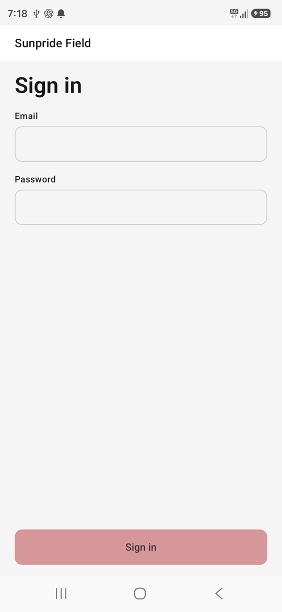 | 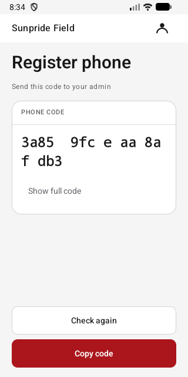 |

1. Open **Sunpride Field**.
2. Enter the **email and password** your admin sent you, then tap **Sign in**.
3. The first time, you see **Register phone** and a **Phone code**. Tap **Copy code** and paste it into a message to your admin. The admin needs this full copied code to register the phone. The short code in large letters is only for checking: the admin can read it back to you to confirm they have the right phone, but it cannot be used to register.
4. Keep the app open. When the admin has added your phone, the app moves on by itself within about 10 seconds. You can also tap **Check again**.

Only one phone can be registered to you at a time. If you change phones, ask your admin first (see [section 10](#10-when-to-escalate-and-to-whom)).

## 2. Start your day

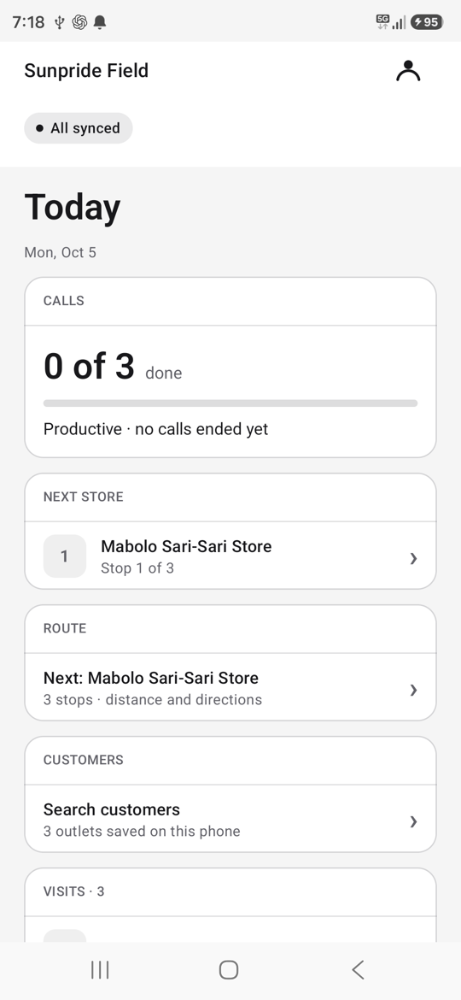

1. Open the app **where you have signal** (at home or the distributor) before the first store. It downloads today's plan.
2. Check the label under the title. **All synced** means today's plan is on your phone.
3. **Today** shows:
   - **Route** — your next store and the number of stops.
   - **Customers** — search the stores saved on your phone.
   - **Visits** — today's planned stores, in plan order.

If **Visits** says _No visits today_ and you expected a route, tap the label at the top, then **Sync now**. If it is still empty, tell your supervisor: your plan for today may not be approved yet.

## 3. Your route

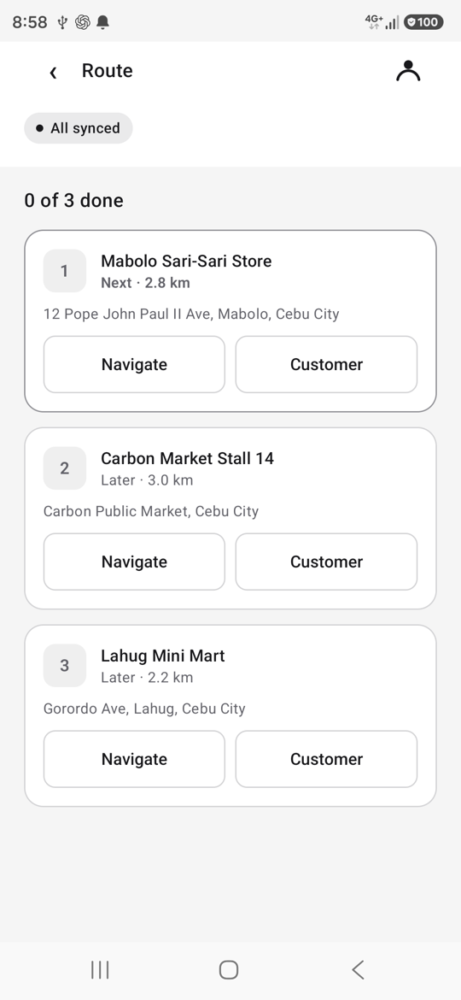

Tap **Route** on Today.

- Stops are numbered in plan order. **Next** is the store to visit now; **Later** stores wait their turn; finished stops show **Done**.
- The distance is a straight line from where you are. Tap **Show distance** if the app asks to use your location.
- **Navigate** opens your maps app with directions to the store.
- **Customer** shows the store's details and **Open visit**.

The route works with no signal; only the maps app needs data for directions.

## 4. Find a customer

|                                                                                         |                                                                               |
| --------------------------------------------------------------------------------------- | ----------------------------------------------------------------------------- |
| 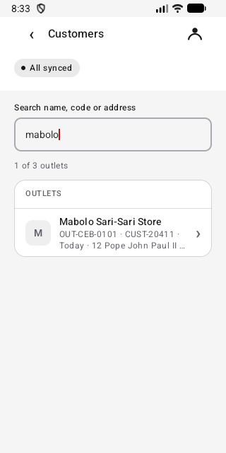 | 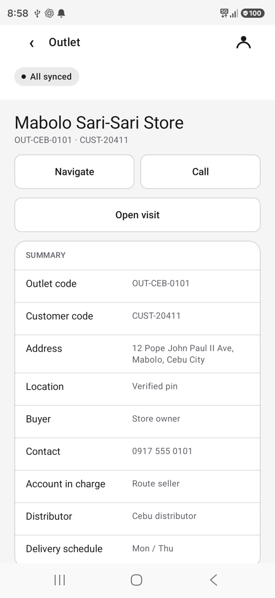 |

1. On Today, tap **Search customers**.
2. Type part of the store name, code, address, buyer or route. Spelling of accents does not matter ("sto nino" finds "Sto. Niño").
3. Tap a store to see its codes, address, buyer, contact, planned visits, tasks and what you recorded there on this phone.
4. **Navigate** opens maps; **Call** opens the dialer with the store's number; **Open visit** starts the visit screen.

You can only find stores on your own plan. To add a **new store**, tell your supervisor for now (see [For trainers](#for-trainers-what-the-pilot-build-does-and-does-not-do)).

## 5. Start a call (check-in)

|                                                                                               |                                                                                             |
| --------------------------------------------------------------------------------------------- | ------------------------------------------------------------------------------------------- |
| 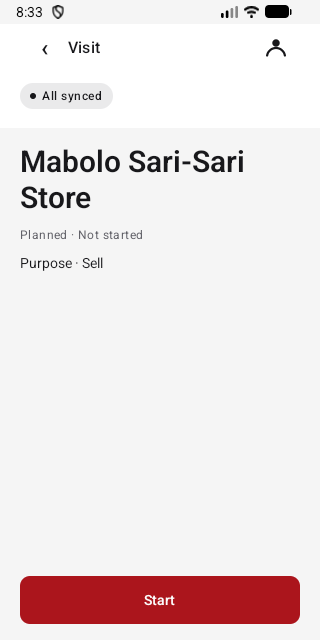 | 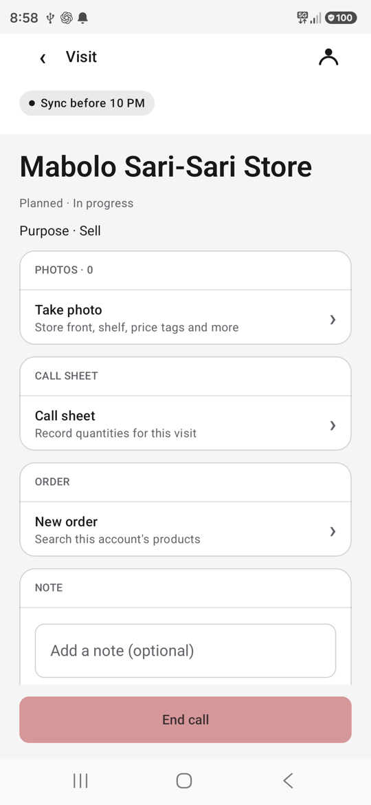 |

1. When you **arrive** at the store, open it from **Today**, **Route** or **Customers**.
2. Tap **Start**. The status changes to **In progress** and the app records the time and your location.
3. If the app asks for your location, choose **While using the app**. If you say no, or there is no GPS fix, the call still starts; your supervisor sees "Location unavailable" and reviews it.

If **Start** is greyed out, the screen tells you why:

- **Visit stores in plan order** — go to the store marked **Next** on your route.
- **Finish the open call first** — go back to the store you started and end that call.

If you must skip a store (closed, owner away), start it and end it as **Not productive** with the reason, so the next store unlocks.

While the call is open you can:

- **Take photo** — store front, shelf and price tags. Photos are saved on the phone and upload later; they never stop you ending the call.
- **Call sheet** — record stock and quantities for the call report (next section).
- **New order** — take the order for the office (next section).
- **Note** — type a short note and tap **Add note**.

## 6. Call sheet and order

A call has two separate parts. The **call sheet** is your report of the store's stock and quantities. The **order** is what the office receives and fills. Saving a call sheet does **not** send an order.

**Call sheet**

|                                                                                                             |                                                                                                      |
| ----------------------------------------------------------------------------------------------------------- | ---------------------------------------------------------------------------------------------------- |
| 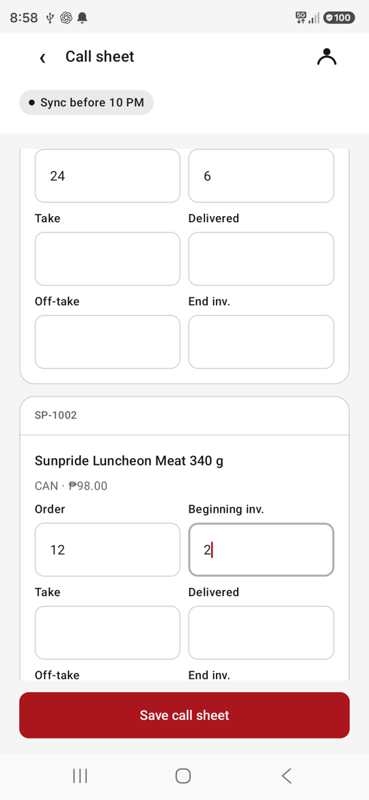 | 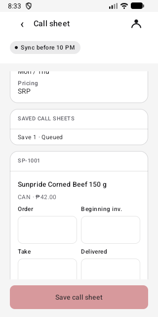 |

1. During the call, tap **Call sheet**.
2. The top shows the account: buyer, contact, distributor, schedule and pricing set by the office.
3. For each product the store carries, fill in what applies: **Order**, **Beginning inv.** (stock on the shelf when you arrived), **Take**, **Delivered**, **Off-take**, **End inv.**, as your channel requires.
4. Use whole numbers. Leave a box empty if it does not apply. Products you leave completely empty are not sent.
5. Tap **Save call sheet**. Under **Saved call sheets** it shows **Queued** (waiting to send), then **Sent**.

Made a mistake? Fill the call sheet again and save it again. Each save is kept; the office uses the latest one. The call sheet's **Order** column is part of your call report only; to place the order, use **New order** below.

**Take the order**

|                                                                                       |                                                                                                       |
| ------------------------------------------------------------------------------------- | ----------------------------------------------------------------------------------------------------- |
| 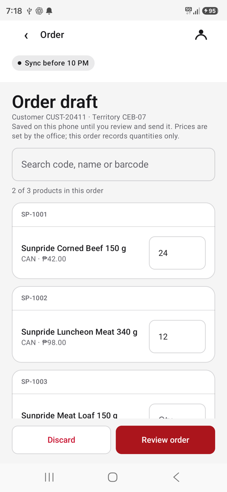 | 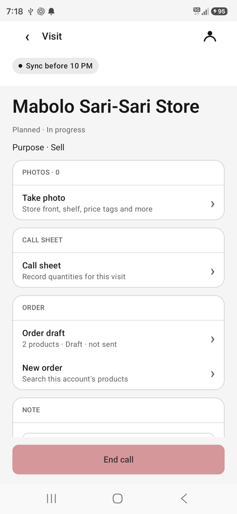 |
| 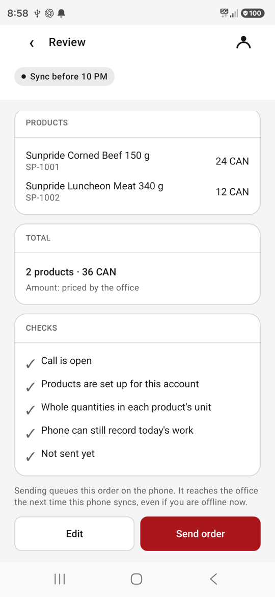     | 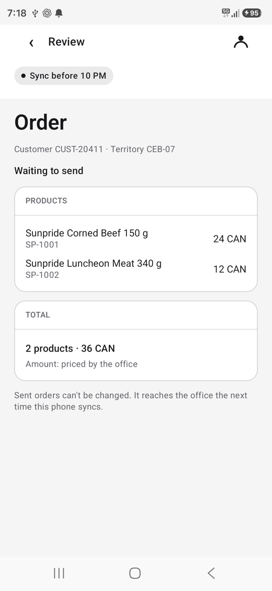              |

1. On the visit screen, under **Order**, tap **New order**. It lists the products set up for this account; type in **Search code, name or barcode** to find one.
2. Enter the **quantity** for each product the store orders (whole numbers, 1 to 99,999). Leave the others empty. The screen counts how many products are in the order.
3. Tap **Save draft**. The draft is saved on the phone only. You can leave it and come back: the visit lists it as **Order draft · Draft · not sent**, and tapping it opens it again to change quantities and **Save draft** again, or **Discard** it.
4. When the quantities are right, tap **Review order**. Check the products, the total (products and units) and **Checks**. Every check must show ✓ (for example **Call is open**, **Products are set up for this account**). A check with **!** tells you what to fix; tap **Edit** to go back.
5. Tap **Send order**. The status changes to **Waiting to send**, then **Received by office · not yet posted** after the phone syncs. This works with no signal: the order waits on the phone and is sent with your next sync.
6. **A sent order cannot be changed.** If it is wrong, or it shows **Not accepted · needs review**, tell your supervisor.

Each product shows its price for the chosen unit (tap a unit, e.g. PC or CS, to switch) or "Priced by the office" when the store's price list has none. The review shows each line's amount, the order total, how many lines the office will price, and a credit check against the store's credit limit and open orders. Over the limit is a warning only: you can still send the order and the office approves it. The office confirms every price when the order arrives. Beta builds use made-up sample prices, marked "Sample prices". There is no stock check on the phone.

**Send before you end the call.** While a draft is unsent, the visit shows _1 order draft is not sent. Review and send before End call, or it stays on this phone._ If you end the call anyway, that draft shows **Not sent · call ended**: it stays on this phone only, the office never receives it, and it can no longer be sent. Tell your supervisor if that happens.

If the screen says _No products set up for this account yet. Ask your office._ (or _No call sheet set up for this account yet_), you cannot take an order on the phone for that store. Write it in a **Note** and tell your supervisor.

## 7. End the call (check-out)

|                                                                                   |                                                                               |
| --------------------------------------------------------------------------------- | ----------------------------------------------------------------------------- |
| 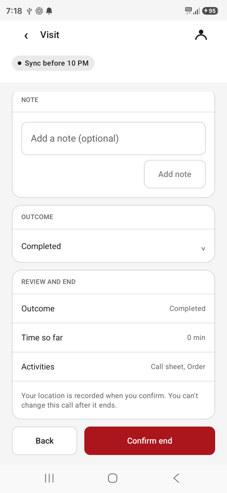 | 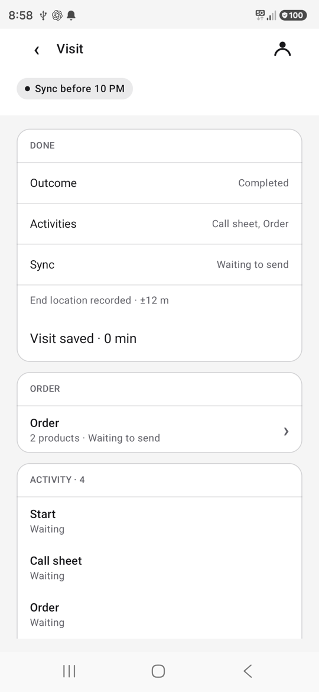 |

1. Under **Outcome**, choose:
   - **Completed** — you did what the visit was for. Choosing Completed does **not** by itself make the call productive. The office counts a call as productive from what you recorded at the store: any one of a purchase order (a sent order), merchandising (display, price tags), inventory count, suggested order, a negotiation, bad-order pickup, collection, or a meeting.
   - **Truck sellers (PMOT, PMOT Extruck, RDS)** must sell. Merchandising alone does **not** make your call productive. It counts only when the store needs no stock and the visit is marked "visited, no sales due to inventory": on the iPhone, switch on **No sales · store has enough stock** under Completed. The Android pilot build has no such switch yet, so on Android a merchandising-only call stays not productive; record the order if the store buys, and tell your supervisor about stores that need no stock.
   - **Not productive** — then enter the **reason code** your supervisor gave you (for example store closed, owner away).
2. If the app lists **Still required: …**, fill in those forms first.
3. Tap **End call**. Check the summary: outcome, time spent, activities.
4. Tap **Confirm end**. Your location is recorded. **You cannot change the call after this.** Tap **Back** instead if something is missing.
5. The **Done** card shows the result and **Sync: Waiting to send** until it is sent. The next store on your route is now unlocked.

## 8. Working without signal

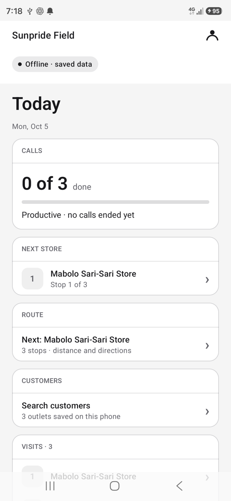

- With no signal and nothing waiting to send, the label says **Offline · saved data** (as in the picture). Once you record something offline, the label shows that waiting work instead: **Sync before 10 PM**, or **Late · held for review** after the day close. **Held** and **Needs review** labels also come before **Offline**. No signal alone never stops you: your plan, route, customers and call sheets are on the phone, so keep working normally (Start, Call sheet, New order, End) **until the 10 PM day close after your last sync**.
- **Offline does not prove you still have access.** With nothing waiting, the Android phone shows **Offline · saved data** even after your access has ended; it never switches to **Day closed** while offline. Open **Sync** and check the **Day close** time: that is when your offline access ends. If it has passed, or the phone refuses a Start, call sheet, order or End, get signal and tap **Sync now**, or tell your supervisor if you cannot.
- **When the phone stops taking new work.** Your offline access lasts until the 10 PM day close after your last successful sync. After that the phone refuses a new Start, call sheet, activity, order or End: you see "Could not queue visit. Sync for access…" or "Today's offline access has ended. Sync to continue." (iPhone: "Day access closed · Reconnect to continue") Work already saved is kept. The label may say **Day closed · sync for access** (with signal and nothing waiting), **Late · held for review** (work still waiting) or **Offline · saved data** (no signal, nothing waiting): the refusal message, not the label, is what tells you access has ended. Get signal and tap **Sync now**; that renews access until the next 10 PM. If you cannot get signal, tell your supervisor which calls you could not record.
- **Held · needs review** means some work on this phone is held. It can be work from your **current** account and area (for example after the phone was removed): then the phone refuses new work ("This phone's work is held for review"). Or it can be old work from a **previous** account or area (for example after you moved area and signed in again): then you can keep recording for your current area normally, and only the old work waits. Either way, syncing alone does not release held work: do not sign out or reinstall, and call your supervisor (see [section 10](#10-when-to-escalate-and-to-whom)).
- Everything you record waits on the phone in order and is sent automatically when signal returns (the phone retries in the background).
- Do **not** uninstall, clear app data or factory-reset the phone. That deletes unsent work.
- Do not sign out to "fix" a problem. Your unsent work stays on the phone, but nothing is sent until you sign back in on the same phone.

## 9. Sync and fixing sync problems

Tap the label at the top of any screen to open **Sync**. **Sync now** sends everything waiting and downloads updates.

| Label at the top                     | What it means                                                                                                                                              | What to do                                                                                                                                                         |
| ------------------------------------ | ---------------------------------------------------------------------------------------------------------------------------------------------------------- | ------------------------------------------------------------------------------------------------------------------------------------------------------------------ |
| **All synced**                       | Everything is sent and today's plan is current.                                                                                                            | Nothing.                                                                                                                                                           |
| **Offline · saved data**             | No signal and nothing waiting to send. You are working from what is on the phone.                                                                          | Keep working until 10 PM. Sync when you have signal.                                                                                                               |
| **Sync before 10 PM**                | Some work is still on the phone.                                                                                                                           | Get signal and tap **Sync now** before 10 PM.                                                                                                                      |
| **Late · held for review**           | The 10 PM day close passed with work unsent.                                                                                                               | Sync as soon as you can. Within 7 days it is still accepted, marked late, and your supervisor reviews it. Older work is refused: tell your supervisor (see below). |
| **Needs review · not synced**        | The office could not accept a visit.                                                                                                                       | Open **Sync**, read the reason, tell your supervisor.                                                                                                              |
| **Held · needs review**              | Some work is held: old work from a previous account or area, or this area's work after the phone was removed. New work is refused only in the second case. | Do not sign out or reinstall. Call your supervisor.                                                                                                                |
| **Day closed · sync for access**     | Your offline access for the day has ended (shown only with signal; offline you see **Offline · saved data** instead).                                      | Get signal and tap **Sync now** to unlock today's plan.                                                                                                            |
| **Visits synced · photos uploading** | Visits are sent; photos are still uploading.                                                                                                               | Leave the app on signal for a few minutes.                                                                                                                         |

|                                                                                                  |                                                                                                    |
| ------------------------------------------------------------------------------------------------ | -------------------------------------------------------------------------------------------------- |
| 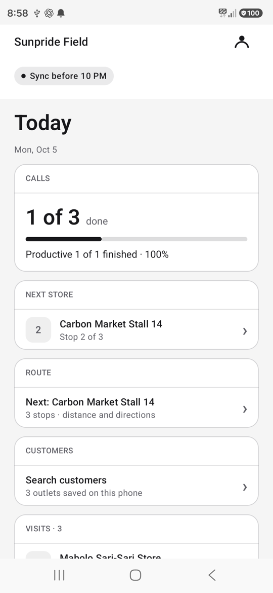 | 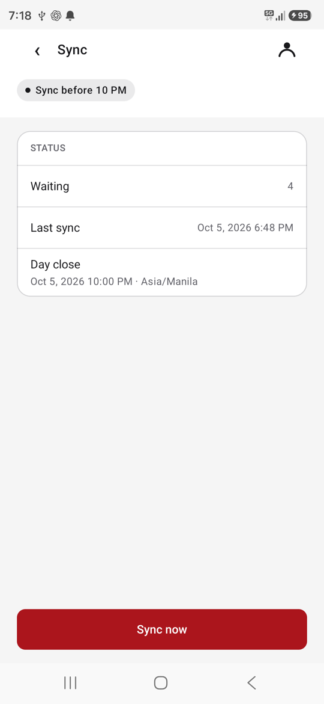 |
| 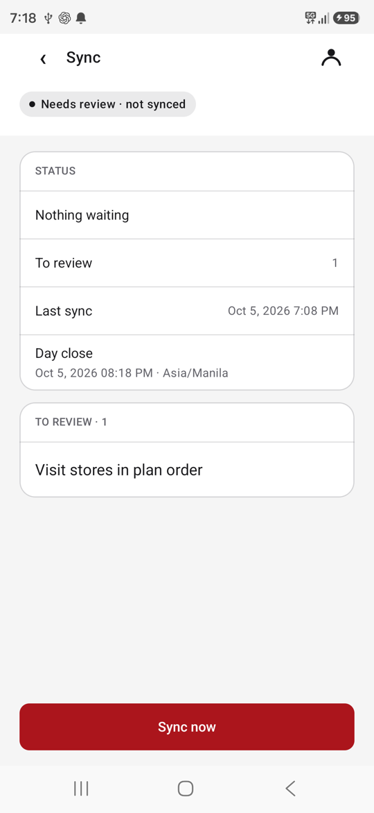           |             |
| 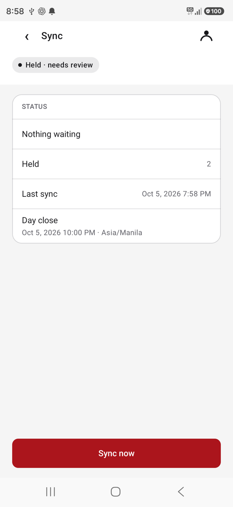                | 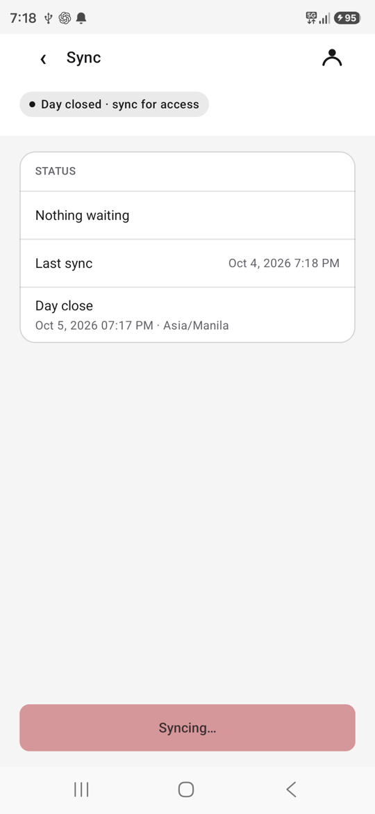                 |

**Recovering from a failed sync**

1. Move to a place with signal (mobile data or Wi-Fi).
2. Open **Sync** and tap **Sync now**. Wait until it finishes.
3. **Waiting** should go down to zero and **Last sync** should show the current time.
4. Still stuck after two tries? Close and reopen the app, then try again.
5. Still stuck, or anything under **To review**? Escalate (next section). Your work stays on the phone meanwhile.

**Late work has a limit.** The office accepts late work only up to 7 days after its day. Work from an older day is refused when it is finally sent (it shows under **To review**, usually as "Visit date does not match the phone date", or under another review reason), and syncing again will not fix it. If any work has been waiting more than a day or two, do not wait for it to go through on its own: show the Sync screen to your supervisor, who checks with the office what was already received and arranges recovery of the rest.

What the **To review** reasons mean:

| Reason                                                                                     | Meaning                                                                                                                                                                                            |
| ------------------------------------------------------------------------------------------ | -------------------------------------------------------------------------------------------------------------------------------------------------------------------------------------------------- |
| Visit stores in plan order                                                                 | A store was visited out of the plan order.                                                                                                                                                         |
| Finish the open call first                                                                 | A store was started while another call was still open.                                                                                                                                             |
| Visit date does not match the phone date                                                   | The visit's date was not accepted. Either the phone's date or time was wrong (set it to automatic date and time), or the work is older than the 7-day late limit. Tell your supervisor either way. |
| Check-in was not accepted; dependent visit needs review                                    | The Start was refused, so the rest of that call waits for the office.                                                                                                                              |
| Visit changed since it was queued                                                          | The plan for that store changed after you recorded it.                                                                                                                                             |
| Server reported a conflict / Server rejected this visit / Visit needs administrator review | The office must look at it.                                                                                                                                                                        |

The phone never deletes items under review on its own. Do not record them again yourself. **An item under review may exist only on this phone**, or the office may already have it:

- **Visit changed since it was queued**, and **Check-in was not accepted; dependent visit needs review** for the call sheet, photos and End of a refused Start: the phone held these back and never sent them, so they are usually only on the phone.
- A refused item is not stored by the office.
- But a **conflict** can mean the office already has that visit: for example, the same Start was accepted earlier and a later retry clashed with it. Then the office keeps the original visit and its receipt, and only the retry sits on the phone.

So treat everything under **To review** as possibly the only copy. If the phone is reset, uninstalled or lost, that work may be gone. Keep the phone, stay signed in, and show the Sync screen to your supervisor. The supervisor first checks with the office what it already received for those stores and times, and only then arranges supervised recovery of whatever is missing, so nothing is entered twice.

## 10. When to escalate, and to whom

| Problem                                                                   | Who                                         | What to send                                |
| ------------------------------------------------------------------------- | ------------------------------------------- | ------------------------------------------- |
| Today's plan is empty or wrong, a store is missing, a store must be added | **Supervisor** (CDS / DS)                   | Store name and date.                        |
| Anything under **To review**, **Held · needs review**, or **Late** work   | **Supervisor**                              | A photo of the Sync screen.                 |
| No call sheet for an account, wrong products or prices                    | **Supervisor** → office                     | Store name and product.                     |
| New or replacement phone, **Register phone** again                        | **Admin**                                   | Your name and the copied Phone code.        |
| **Phone removed**                                                         | **Admin**, and your supervisor              | Your name, phone model and Fingerprint.     |
| Phone **lost or stolen**                                                  | **Admin, immediately**, and your supervisor | When and where. The admin blocks the phone. |
| App crashes or keeps failing to sync                                      | **Admin**                                   | **Support info** (below).                   |
| Supervisor away                                                           | **Manager**                                 | Same as above.                              |

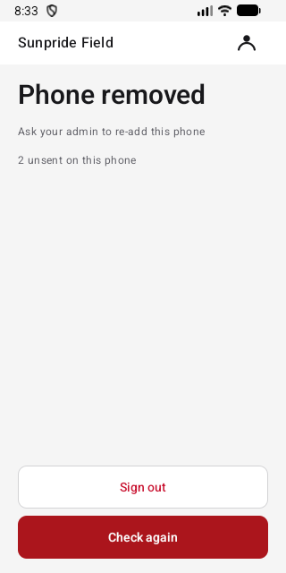 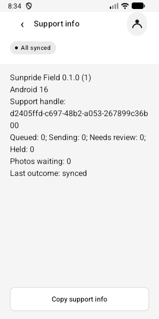

**Phone removed** means an admin blocked this phone. The app stops sending and keeps any unsent work on the phone ("2 unsent on this phone"). Do not sign out, uninstall or reset the phone, and keep it with you. Call your admin. To tell them which phone it is, tap the person icon at the top right: **Account** shows the phone **Model** and its **Fingerprint** (do not tap **Sign out** there). Then go back.

"Unsent" means the phone has no confirmation from the office. It does **not** prove the office never got it: if the signal dropped just after a send, the office may already have that visit while the phone still counts it as unsent. So nobody re-enters this work until the office has checked what it already received (see [To review](#9-sync-and-fixing-sync-problems)).

The admin blocked the phone in one of two ways:

- **Suspended** (for example, it was reported lost and might turn up): this can be undone. If the admin confirms the phone is back with you, they reinstate it for you, the same person in the same area, as long as no replacement phone has been registered for you since. When the admin says it is done, get signal and tap **Check again** on the **Phone removed** screen. The app reloads and opens **Today** (the app does not check by itself on this screen). If the label still shows work waiting, tap the label, then **Sync now**. The phone sends its unsent work; anything the office already had is recognised and not counted twice. If **Phone removed** stays after **Check again**, call the admin again.
- **Revoked** (lost for good, stolen, replaced or handed to someone else): this is permanent. The phone can never sync again, and registering it again or getting a new phone does not send its old work. Hand the phone to your supervisor or admin as they instruct. The supervisor first checks with the office which of those visits and orders it already received, and only the missing ones are recovered from the phone under supervision and recorded through the office's process. Do not try to re-enter the visits yourself unless they tell you to.

If the phone itself is lost, any work that never reached the office is lost with it; only what the office already received is safe.

**Support info:** tap the person icon at the top right → **Support info** → **Copy support info**, and paste it into your message. It contains only the app version, counts and an anonymous code; no passwords, customers or locations.

Never send your password, or screenshots of it, to anyone. The admin never needs it.

## 11. End your day

1. Make sure your last call shows **Done**.
2. Get signal and tap the label → **Sync now**, **before 10 PM**.
3. Check the label says **All synced** (or _Visits synced · photos uploading_, then leave the phone on signal).
4. Anything else showing? Tell your supervisor before you finish.

---

## Quick reference

| You want to…       | Tap                                                                             |
| ------------------ | ------------------------------------------------------------------------------- |
| See today's stores | **Today**                                                                       |
| Get directions     | **Route** → **Navigate**                                                        |
| Find a store       | **Search customers**                                                            |
| Arrive at a store  | Store → **Start**                                                               |
| Record stock       | **Call sheet** → fill in → **Save call sheet**                                  |
| Take an order      | **New order** → quantities → **Save draft** → **Review order** → **Send order** |
| Leave a store      | **Outcome** → **End call** → **Confirm end**                                    |
| Send your work     | Label at the top → **Sync now**                                                 |
| Get help           | Person icon → **Support info** → **Copy support info**                          |

---

## For trainers: what the pilot build does and does not do

Check these before training sellers. They are the current state of the software, not of this guide.

1. **Visit recording is only in the test (DEV) build today.** Start / End call, call sheet, photos and notes are switched on only in the DEV debug build (`apps/field-android/.../MainActivity.kt`: `debug = BuildConfig.DEBUG && FLAVOR == "dev"`). The staging and production builds show Today, Route, Customers and Sync, but no **Start** button. A pilot build with visit recording switched on must be agreed before field training.
2. **Orders: New order, separate from the call sheet.** Sellers take orders with **New order** on the visit: an editable draft saved on the phone, **Review order** with local checks, then **Send order**, which queues one order (`order_intent`) for the next sync. Sent orders are frozen. An unsent draft triggers a warning before End call; if the call ends first it is left as **Not sent · call ended** on that phone only. Orders show prices from the store's price list per selling unit, an order total and an advisory credit check (sample prices in beta; the server re-prices every order and records the credit result), there is no stock calculation on the phone, and the office shows a received order as "not yet posted". The call sheet's **Order** column is still recorded with the call report; train sellers that it does not place an order.
3. **Adding a new store** is not on the phone yet. Sellers report new stores to their supervisor (call answer: the seller pre-enrols, the supervisor or manager approves).
4. **Not-productive reason codes** are typed, not chosen from a list. Supervisors should give sellers the agreed codes.
5. **iPhone:** the iOS app has the same flow: sign-in, phone registration, Today with **Route** and **Customer search**, the visit screen with call sheet and **New order** (draft, review, send), and the same sync labels. Wording and layout differ slightly; this guide shows Android.
6. **Supervisors** with a team also see **Team** on Today (coverage and exceptions for direct reports); not covered here.
7. Office-side history from other phones is not shown on the phone; the customer screen shows only what was recorded on this phone.
8. **Phone removed: suspension vs revocation** (runbook `docs/runbooks/MOBILE_DEVICE_INCIDENT.md`). Suspension is reversible: an admin with access to the phone's area can reinstate it for the same employee in the same unit, if no replacement was enrolled since, and the held work then syncs (designed, not yet proven on a real phone). Revocation is permanent: no reinstatement, re-registration or new phone sends the old phone's outbox, and the server refuses another device replaying its operation IDs. Its unsent work needs supervised recovery from the phone under custody; trainers must not promise sellers that an admin can "restore" a revoked phone. Items under **To review** may exist only in the phone's outbox (typically a refused Start and the call sheet/End held behind it), but not always: a fresh-key retry of a visit the server already accepted shows as a conflict while the original server visit and its acknowledgement remain. Before any supervised recapture, reconcile against the office's received visits and acknowledgements so accepted work is not recorded twice. The same applies to a removed phone: its "unsent" count only means no acknowledgement reached the phone, and a send the server accepted whose response was lost still counts as unsent locally. After reinstating a suspended phone, the seller taps **Check again** on the Phone removed screen (it does not poll by itself) before **Sync now**. Register phones only with the full code from **Copy code**; the large Phone code is a fingerprint for confirmation and is refused as a registration key.
9. **Late work: 7-day limit, no warning on the phone** (`packages/backend/convex/visits/policy.ts` `lateWindowDays: 7`). Work reaching the server after the 10 PM close is accepted, flagged late and held for supervisor review only if its service date is within the last 7 days; older work is refused (`wrong_date`, or `invalid_request` for a device time beyond the window) without being stored, and re-syncing does not change that. The **Late · held for review** label looks the same on day 1 and day 8. A `wrong_date` review item is therefore not always a wrong phone clock. Treat queued work older than a day or two as an escalation: reconcile what the office already received, then arrange supervised recovery of the rest. The **Offline · saved data** label appears only when nothing is waiting; held, review, queued and late labels take priority over it, so an offline seller who has already recorded a call sees **Sync before 10 PM** (or **Late**), not Offline.
10. **Offline recording stops at the lease, not just the label** (Android `RoomFieldStore.isLeaseValid`/`enqueue`, order drafts in `FieldStore.kt`; iOS `StoreError.leaseExpired`). The offline lease is `nextDayCloseAt(last successful sync)`, so recording offline works only until the 10 PM after the last sync. Once it expires, or while the partition is held, the phone refuses every new Start, call sheet, activity, order draft and End; saved work is kept. **Late** usually coincides with an expired lease. **Held** does not always block new work: the Android label counts prior-scope queued work as held (`SyncStatus.fromRoom`), and iOS shows it via `otherHeldWork`, while the newly verified current partition can have a valid lease and accept new recording; only a held **current** partition refuses new work. Conversely, **Offline · saved data** takes precedence over **Day closed** when nothing is queued, so an expired offline lease need not show Day closed. Train sellers that Offline does not prove recording access: check **Day close** on the Sync screen, sync during the day, and renew or escalate when the phone refuses recording or current work is held.
11. **Productive call** (`packages/backend/convex/sfa/productive_call.ts`, `productive-call/2026-10-02`). The End outcome never decides productivity: Completed with only a note is not productive. Under the `truck_seller` rule (PMOT, PMOT Extruck, RDS), merchandising counts only with the `no_sales_due_to_inventory` marker. iOS records it through the **No sales · store has enough stock** switch under Completed; the Android pilot build sends a reason code only with Not productive and has no marker for a Completed call, so an Android truck seller's merchandising-only call stays not productive. Do not teach typing the marker as a Not productive reason as a workaround; that needs a product decision.

Client rules used here: the 2 Oct 2026 call answers (no distance limit, MCP order and close-the-call-before-the-next rule, Start/End for time spent, 10 PM day close, productive-call definition, new-store approval) and `docs/requirements/SALES_OPS_STANDARDS_MEMO_2026-01-20.md`.

## Refreshing the screenshots

The pictures come from the instrumented test `apps/field-android/app/src/androidTest/java/com/sunpride/field/FieldSalesGuideScreenshotsTest.kt`, which drives the real app screens with fictional data and also checks the flow (call sheet saved, order drafted, reviewed and sent once, End queued, sync labels). The current set was taken on the Galaxy test phone (3-button navigation) and scaled to 540 px wide with `sips -Z 1170`. On a physical phone, route the receiver through `adb reverse` and pass the host:

```sh
python3 apps/field-android/scripts/receive-screenshots.py docs/guides/field-sales/images --prefix guide- &
adb reverse tcp:28765 tcp:28765
adb shell am instrument -w -e class com.sunpride.field.FieldSalesGuideScreenshotsTest \
  -e calmScreenshots true -e calmScreenshotHost 127.0.0.1 \
  com.sunpride.field.dev.test/androidx.test.runner.AndroidJUnitRunner
adb reverse --remove tcp:28765; kill %1
```

Install the dev app and test APK first (`./gradlew installDevDebug installDevDebugAndroidTest`), take the shared phone lock used by `sunpride-android-phone-test.sh`, and afterwards uninstall only `com.sunpride.field.dev.test`. On an emulator, omit `adb reverse` and `calmScreenshotHost` (it reaches the host at 10.0.2.2). Without `calmScreenshots=true` the test still runs its checks and sends no pictures.
